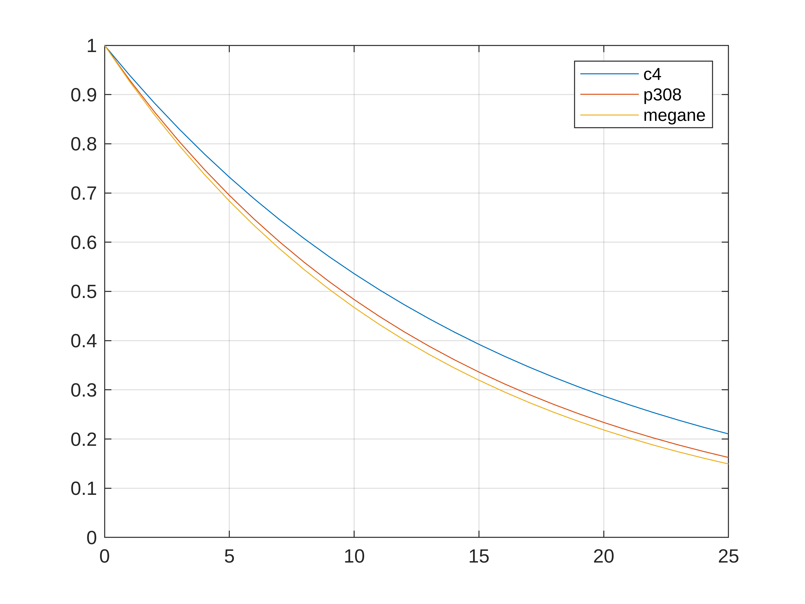
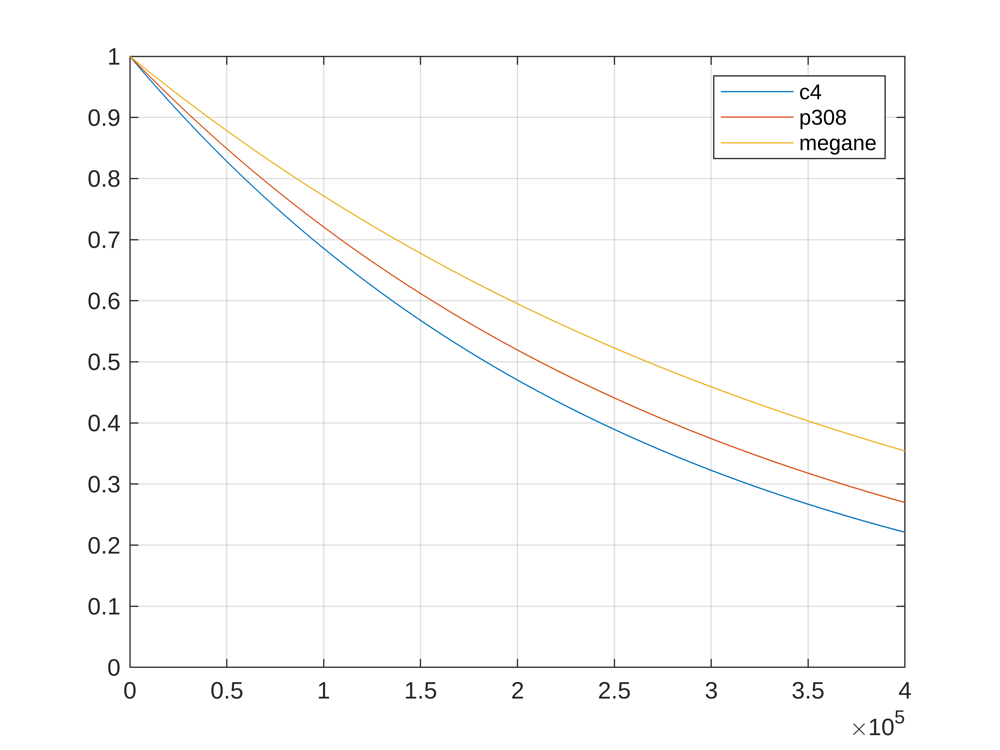

# Data analysis of Bilbasen data set
```matlab
clear;
```
# Load data set
```matlab
opts = detectImportOptions("bilbasen_scrape.csv");
source = readtable("bilbasen_scrape.csv", opts);
preview("bilbasen_scrape.csv", opts)
```
| |Make|Model|Configuration|Rating|Price|Registered|Kilometers|Fuel|Consumption|Tax|Power|Transmission|TowCapacity|PriceNew|Trunk|Width|Length|Height|
|:--:|:--:|:--:|:--:|:--:|:--:|:--:|:--:|:--:|:--:|:--:|:--:|:--:|:--:|:--:|:--:|:--:|:--:|:--:|
|1|'Ford'|'Kuga'|'2,5 PHEV Vignale CVT 5d'|4.4000|'226.300 kr.'|'7/2020'|'83.000 km'|'Plug-in hybrid Benzin'|'(NEDC) 37,5 km/l'|'1.040 kr. / år'|'225 hk/-'|'Automatisk'|'1.200 kg'|'326.009 kr.'|'411 liter'|'188 cm'|'461 cm'|'166 cm'|
|2|'Peugeot'|'3008'|'1,6 Hybrid First Selection EAT8 5d'|4.4000|'199.900 kr.'|'2/2021'|'80.000 km'|'Plug-in hybrid Benzin'|'(NEDC) 86,4 km/l'|'840 kr. / år'|'225 hk/360 nm'|'Automatisk'|'1.250 kg'|'340.907 kr.'|'395 liter'|'184 cm'|'445 cm'|'162 cm'|
|3|'VW'|'Passat'|'1,4 GTE Variant DSG 5d'|4.3000|'239.000 kr.'|'5/2020'|'83.000 km'|'Plug-in hybrid Benzin'|'(NEDC) 34,3 km/l'|'1.080 kr. / år'|'218 hk/400 nm'|'Automatisk'|'1.600 kg'|'415.912 kr.'|'483 liter'|'183 cm'|'477 cm'|'152 cm'|
|4|'Ford'|'Kuga'|'2,5 PHEV Vignale CVT 5d'|NaN|'259.900 kr.'|'11/2021'|'36.000 km'|'Plug-in hybrid Benzin'|'(NEDC) 46,1 km/l'|'840 kr. / år'|'225 hk/-'|'Automatisk'|'1.500 kg'|'398.467 kr.'|'411 liter'|'188 cm'|'461 cm'|'166 cm'|
|5|'VW'|'Golf VIII'|'1,4 eHybrid DSG 5d'|4.6000|'209.900 kr.'|'2/2021'|'72.000 km'|'Plug-in hybrid Benzin'|'(NEDC) 50,2 km/l'|'840 kr. / år'|'204 hk/350 nm'|'Automatisk'|'1.500 kg'|'315.815 kr.'|'280 liter'|'179 cm'|'428 cm'|'146 cm'|
|6|'Skoda'|'Octavia'|'1,4 TSi iV Plus DSG 5d'|4.5000|'213.900 kr.'|'6/2021'|'71.000 km'|'Plug-in hybrid Benzin'|'(WLTP) 100,0 km/l'|'940 kr. / år'|'204 hk/350 nm'|'Automatisk'|'1.500 kg'|'315.815 kr.'|'450 liter'|'183 cm'|'469 cm'|'149 cm'|
|7|'Ford'|'Kuga'|'2,5 PHEV Vignale CVT 5d'|4.4000|'239.800 kr.'|'12/2020'|'56.500 km'|'Plug-in hybrid Benzin'|'(NEDC) 37,5 km/l'|'1.040 kr. / år'|'225 hk/-'|'Automatisk'|'1.200 kg'|'326.009 kr.'|'411 liter'|'188 cm'|'461 cm'|'166 cm'|
|8|'Peugeot'|'208'|'1,5 BlueHDi 100 Active 5d'|4.2000|'79.900 kr.'|'5/2020'|'74.400 km'|'Diesel'|'(WLTP) 21,7 km/l'|'1.400 kr. / år'|'100 hk/250 nm'|'Manuel'|'1.150 kg'|'160.911 kr.'|'309 liter'|'175 cm'|''|''|


Some fiddling to learn syntax

```matlab
source(1:3, 1:6)
```
| |Make|Model|Configuration|Rating|Price|Registered|
|:--:|:--:|:--:|:--:|:--:|:--:|:--:|
|1|'Ford'|'Kuga'|'2,5 PHEV Vignale CVT 5d'|4.4000|'226.300 kr.'|'7/2020'|
|2|'Peugeot'|'3008'|'1,6 Hybrid First Selection EAT8 5d'|4.4000|'199.900 kr.'|'2/2021'|
|3|'VW'|'Passat'|'1,4 GTE Variant DSG 5d'|4.3000|'239.000 kr.'|'5/2020'|

```matlab
source(1:6, "Model")
```
| |Model|
|:--:|:--:|
|1|'Kuga'|
|2|'3008'|
|3|'Passat'|
|4|'Kuga'|
|5|'Golf VIII'|
|6|'Octavia'|

```matlab
source.Model(1:6)
```

```matlabTextOutput
ans = 6x1 cell
'Kuga'      
'3008'      
'Passat'    
'Kuga'      
'Golf VIII' 
'Octavia'   

```

```matlab
source.Properties.VariableNames
```

```matlabTextOutput
ans = 1x18 cell
'Make'      'Model'     'Configuration''Rating'    'Price'     'Registered''Kilometers''Fuel'      'Consumption''Tax'       'Power'     'Transmission''TowCapacity''PriceNew'  'Trunk'     'Width'     'Length'    'Height'    

```

```matlab
source.Properties.VariableTypes
```

```matlabTextOutput
ans = 1x18 string
"cell"      "cell"      "cell"      "double"    "cell"      "cell"      "cell"      "cell"      "cell"      "cell"      "cell"      "cell"      "cell"      "cell"      "cell"      "cell"      "cell"      "cell"      

```
# Check for empty cells in selected columns
```matlab
% Get column as cell matrix (height) or table (b)
height = source.("Height");
b = source(:, "Height");

% Convert to string and look for non-empty strings
indexes_of_non_empty_cells = find(string(height) ~= "")
```

```matlabTextOutput
indexes_of_non_empty_cells = 1118x1
     1
     2
     3
     4
     5
     6
     7
     9
    10
    12

```

```matlab
height = height(indexes_of_non_empty_cells)
```

```matlabTextOutput
height = 1118x1 cell
'166 cm'    
'162 cm'    
'152 cm'    
'166 cm'    
'146 cm'    
'149 cm'    
'166 cm'    
'148 cm'    
'151 cm'    
'166 cm'    

```
# Remove characters from cells and convert to number

The height column content is formatted like '168 cm'. Removing the last three characters allows us to convert to doubles.

```matlab
height = double(erase(string(height), " cm"))
```

```matlabTextOutput
height = 1118x1
   166
   162
   152
   166
   146
   149
   166
   148
   151
   166

```

Check for and remove 'NaN' values

```matlab
height = height(find(not(isnan(height))))
```

```matlabTextOutput
height = 1116x1
   166
   162
   152
   166
   146
   149
   166
   148
   151
   166

```

Column is now cleaned.

```matlab
min(height)
```

```matlabTextOutput
ans = 139
```

```matlab
max(height)
```

```matlabTextOutput
ans = 172
```

```matlab
mean(height)
```

```matlabTextOutput
ans = 154.3217
```
# Add a column with age of car

This can be calculated from the registration month of the car. MATLABs datetime type is useful for this metric.

```matlab
registered = string(source.("Registered"));
registered = datetime(registered, "InputFormat","MM/yyyy");
source.Age = calmonths(between(registered, datetime("today"))) / 12;
```
# Clean up km column and PriceNew column
```matlab
km = string(source.Kilometers);
km = double(erase(km,[" km", "."]));
source.("Kilometers") = km;

price = string(source.Price);
price = double(erase(price, [" kr.", "."]));
source.Price = price;

pricenew = string(source.PriceNew);
pricenew = double(erase(pricenew, [" kr.", "."]));
source.PriceNew = pricenew;
```
# Find every car less than 50.000 kr

Clean price column

```matlab
df = source;
price = df.("Price");
% Convert to string and look for non-empty strings
indexes_of_non_empty_cells = find(string(price) ~= "");
df = df(indexes_of_non_empty_cells, :);

price = erase(string(price), " kr.");
price = double(erase(string(price), "."));
df = df(find(not(isnan(price))),:);
```

Cleaned, ready for logical indexing.

```matlab
lessthan50k = df(price <= 50000, :)
```
| |Make|Model|Configuration|Rating|Price|Registered|Kilometers|Fuel|Consumption|Tax|Power|Transmission|TowCapacity|PriceNew|Trunk|Width|Length|Height|Age|
|:--:|:--:|:--:|:--:|:--:|:--:|:--:|:--:|:--:|:--:|:--:|:--:|:--:|:--:|:--:|:--:|:--:|:--:|:--:|:--:|
|1|'Fiat'|'Punto'|'0,9 TwinAir 100 Lounge 5d'|3.9000|39000|'1/2015'|175000|'Benzin'|'(NEDC) 26,3 km/l'|'840 kr. / år'|'100 hk/145 nm'|'Manuel'|'1.000 kg'|172999|'-'|'169 cm'|'407 cm'|'149 cm'|10.3333|
|2|'Citroën'|'Grand C4 Picasso'|'1,6 BlueHDi 120 Intensive 7prs 5d'|4.1000|39900|'2/2014'|321000|'Diesel'|'(NEDC) 25,0 km/l'|'1.860 kr. / år'|'120 hk/300 nm'|'Manuel'|'1.500 kg'|359993|'-'|'183 cm'|''|''|11.2500|
|3|'Citroën'|'C3'|'1,6 BlueHDi 100 Seduction Upgrade 5d'|4.1000|44900|'12/2015'|179900|'Diesel'|'(NEDC) 33,3 km/l'|'240 kr. / år'|'100 hk/254 nm'|'Manuel'|'1.150 kg'|149000|'-'|'173 cm'|''|''|9.4167|
|4|'Citroën'|'C3'|'1,6 BlueHDi 100 Seduction Upgrade 5d'|4.1000|49900|'7/2015'|177000|'Diesel'|'(NEDC) 33,3 km/l'|'240 kr. / år'|'100 hk/254 nm'|'Manuel'|'1.150 kg'|149000|'-'|'173 cm'|'394 cm'|'152 cm'|9.8333|
|5|'Citroën'|'C3'|'1,6 BlueHDi 100 Seduction Upgrade 5d'|4.1000|46900|'6/2015'|188000|'Diesel'|'(NEDC) 33,3 km/l'|'240 kr. / år'|'100 hk/254 nm'|'Manuel'|'1.150 kg'|149000|'-'|'173 cm'|'394 cm'|'152 cm'|9.9167|
|6|'Opel'|'Astra'|'1,3 CDTi 95 Sport eco 5d'|4|44800|'4/2012'|229000|'Diesel'|'(NEDC) 25,6 km/l'|'1.860 kr. / år'|'95 hk/190 nm'|'Manuel'|'1.000 kg'|294601|'-'|'181 cm'|''|''|13.0833|
|7|'Volvo'|'V50'|'1,6 D DRIVe 5d'|4.4000|24900|'3/2010'|242000|'Diesel'|'(NEDC) 25,6 km/l'|'1.860 kr. / år'|'109 hk/240 nm'|'Manuel'|'1.300 kg'|344004|'-'|'177 cm'|''|''|15.1667|
|8|'Fiat'|'Punto'|'0,9 TwinAir 100 Popstar Edition 5d'|3.9000|49900|'9/2016'|173400|'Benzin'|'(NEDC) 26,3 km/l'|'840 kr. / år'|'100 hk/145 nm'|'Manuel'|'1.000 kg'|127602|'-'|'169 cm'|''|''|8.6667|
|9|'Citroën'|'C4'|'1,6 BlueHDi 100 Challenge 5d'|4.2000|49700|'5/2017'|227000|'Diesel'|'(NEDC) 30,3 km/l'|'1.040 kr. / år'|'100 hk/254 nm'|'Manuel'|'1.550 kg'|189883|'-'|'179 cm'|'433 cm'|'149 cm'|8|
|10|'Renault'|'Megane III'|'1,5 dCi 110 Dynamique Sport Tourer 5d'|4.4000|34900|'4/2013'|265000|'Diesel'|'(NEDC) 28,6 km/l'|'1.040 kr. / år'|'110 hk/260 nm'|'Manuel'|'1.300 kg'|296900|'-'|'180 cm'|''|''|12.0833|
|11|'Hyundai'|'i30'|'1,6 CRDi 110 Comfort Eco 5d'|NaN|44900|'6/2014'|215000|'Diesel'|'(NEDC) 27,0 km/l'|'1.860 kr. / år'|'110 hk/260 nm'|'Manuel'|'1.500 kg'|216450|'-'|'178 cm'|''|''|10.9167|
|12|'Volvo'|'V50'|'1,6 D DRIVe 5d'|4.4000|22500|'6/2010'|330000|'Diesel'|'(NEDC) 25,6 km/l'|'1.860 kr. / år'|'109 hk/240 nm'|'Manuel'|'1.300 kg'|344004|'-'|'177 cm'|'452 cm'|'146 cm'|14.9167|
|13|'Nissan'|'Juke'|'1,5 dCi 110 Tekna 5d'|4.2000|44900|'12/2013'|247000|'Diesel'|'(NEDC) 25,0 km/l'|'1.860 kr. / år'|'110 hk/240 nm'|'Manuel'|'1.250 kg'|315089|'-'|'177 cm'|''|''|11.4167|
|14|'Peugeot'|'308'|'1,6 BlueHDi 120 Active SW 5d'|4.3000|45000|'4/2015'|277000|'Diesel'|'(NEDC) 31,3 km/l'|'1.040 kr. / år'|'120 hk/300 nm'|'Manuel'|'1.300 kg'|271745|'-'|'180 cm'|'459 cm'|'147 cm'|10.0833|
|15|'Hyundai'|'i30'|'1,6 CRDi 110 EM-Edition CW 5d'|NaN|45000|'6/2016'|293000|'Diesel'|'(NEDC) 25,6 km/l'|'1.860 kr. / år'|'110 hk/280 nm'|'Manuel'|'1.500 kg'|269995|'-'|'178 cm'|'449 cm'|'150 cm'|8.9167|
|16|'Skoda'|'Octavia'|'1,6 TDi 110 Active Combi 5d'|4.5000|47000|'2/2016'|333000|'Diesel'|'(NEDC) 26,3 km/l'|'1.860 kr. / år'|'110 hk/250 nm'|'Manuel'|'1.500 kg'|258000|'-'|'181 cm'|'466 cm'|'145 cm'|9.2500|
|17|'Skoda'|'Rapid'|'1,6 TDi 105 Ambition GreenTec 5d'|4.5000|44900|'2/2013'|336000|'Diesel'|'(NEDC) 25,6 km/l'|'1.860 kr. / år'|'105 hk/250 nm'|'Manuel'|'1.200 kg'|209997|'-'|'171 cm'|''|''|12.2500|
|18|'Seat'|'Leon'|'1,6 TDi Style 5d'|4.4000|44900|'1/2012'|307000|'Diesel'|'(NEDC) 26,3 km/l'|'1.860 kr. / år'|'105 hk/250 nm'|'Manuel'|'1.400 kg'|276902|'-'|'177 cm'|''|''|13.3333|
|19|'Ford'|'Focus'|'1,5 TDCi 120 Trend stc. 5d'|4.3000|44900|'12/2015'|315000|'Diesel'|'(NEDC) 26,3 km/l'|'1.860 kr. / år'|'120 hk/270 nm'|'Manuel'|'1.200 kg'|265158|'-'|'182 cm'|''|''|9.4167|
|20|'Citroën'|'C3'|'1,6 BlueHDi 100 Seduction Upgrade 5d'|4.1000|49900|'8/2015'|190000|'Diesel'|'(NEDC) 33,3 km/l'|'240 kr. / år'|'100 hk/254 nm'|'Manuel'|'1.150 kg'|149000|'-'|'173 cm'|'394 cm'|'152 cm'|9.7500|
|21|'Peugeot'|'308'|'1,6 BlueHDi 120 Active 5d'|4.3000|47900|'12/2016'|245000|'Diesel'|'(NEDC) 31,3 km/l'|'1.040 kr. / år'|'120 hk/300 nm'|'Manuel'|'1.300 kg'|266993|'-'|'180 cm'|''|''|8.4167|
|22|'Peugeot'|'308'|'1,6 BlueHDi 120 Style SW 5d'|NaN|44900|'8/2015'|235000|'Diesel'|'(NEDC) 31,3 km/l'|'1.040 kr. / år'|'120 hk/300 nm'|'Manuel'|'1.300 kg'|271745|'-'|'180 cm'|''|''|9.7500|
|23|'Fiat'|'Punto'|'0,9 TwinAir 100 Popstar 5d'|3.9000|34900|'5/2015'|171000|'Benzin'|'(NEDC) 26,3 km/l'|'840 kr. / år'|'100 hk/145 nm'|'Manuel'|'1.000 kg'|143620|'-'|'169 cm'|'407 cm'|'149 cm'|10|
|24|'Citroën'|'Grand C4 Picasso'|'1,6 e-HDi 115 Attraction 5d'|4.1000|39900|'1/2014'|356000|'Diesel'|'(NEDC) 25,0 km/l'|'1.860 kr. / år'|'115 hk/270 nm'|'Manuel'|'1.500 kg'|294991|'-'|'183 cm'|''|''|11.3333|
|25|'Skoda'|'Octavia'|'1,6 TDi 105 Elegance Combi DSG 5d'|4.5000|49900|'11/2013'|376000|'Diesel'|'(NEDC) 25,0 km/l'|'1.860 kr. / år'|'105 hk/250 nm'|'Automatisk'|'1.500 kg'|313001|'-'|'181 cm'|''|''|11.5000|
|26|'VW'|'Golf VI'|'1,6 TDi 105 BlueMotion 5d'|4.4000|47900|'8/2011'|287000|'Diesel'|'(NEDC) 26,3 km/l'|'1.860 kr. / år'|'105 hk/250 nm'|'Manuel'|'1.400 kg'|282202|'-'|'178 cm'|''|''|13.7500|
|27|'Volvo'|'V40'|'1,6 D2 115 Drive-E 5d'|NaN|44900|'7/2014'|318000|'Diesel'|'(NEDC) 29,4 km/l'|'1.040 kr. / år'|'115 hk/270 nm'|'Manuel'|'1.300 kg'|269893|'-'|'180 cm'|''|''|10.8333|
|28|'Renault'|'Scenic III'|'1,5 dCi 110 Expression aut. 5d'|4.2000|37500|'4/2011'|210000|'Diesel'|'(NEDC) 210.000,0 km/l'|'240 kr. / år'|'110 hk/240 nm'|'Automatisk'|'1.300 kg'|300099|'-'|'185 cm'|'434 cm'|'164 cm'|14.0833|
|29|'Peugeot'|'308'|'1,6 e-HDi 114 Style 5d'|4.3000|39400|'9/2013'|212000|'Diesel'|'(NEDC) 26,3 km/l'|'1.860 kr. / år'|'114 hk/270 nm'|'Manuel'|'1.500 kg'|214989|'-'|'182 cm'|''|''|11.6667|
|30|'Citroën'|'C3'|'1,6 BlueHDi 100 Seduction Upgrade 5d'|4.1000|49900|'10/2015'|148000|'Diesel'|'(NEDC) 33,3 km/l'|'240 kr. / år'|'100 hk/254 nm'|'Manuel'|'1.150 kg'|149000|'-'|'173 cm'|''|''|9.5833|
|31|'Opel'|'Meriva'|'1,6 CDTi 95 Enjoy 5d'|4.1000|44900|'7/2016'|228000|'Diesel'|'(NEDC) 25,0 km/l'|'1.860 kr. / år'|'95 hk/280 nm'|'Manuel'|'1.050 kg'|259998|'-'|'181 cm'|'430 cm'|'162 cm'|8.8333|
|32|'Opel'|'Astra'|'1,6 CDTi 136 Enjoy 5d'|4|49700|'4/2014'|223000|'Diesel'|'(NEDC) 25,6 km/l'|'1.860 kr. / år'|'136 hk/320 nm'|'Manuel'|'1.300 kg'|294603|'-'|'182 cm'|''|''|11.0833|
|33|'Skoda'|'Octavia'|'1,6 TDi 105 Ambiente 5d'|4.5000|29400|'10/2011'|291000|'Diesel'|'(NEDC) 26,3 km/l'|'1.860 kr. / år'|'105 hk/250 nm'|'Manuel'|'1.400 kg'|258999|'-'|'177 cm'|'457 cm'|'147 cm'|13.5833|
|34|'VW'|'Golf VII'|'1,6 TDi 105 BlueMotion 5d'|4.6000|49999|'12/2012'|379000|'Diesel'|'(NEDC) 26,3 km/l'|'1.860 kr. / år'|'105 hk/250 nm'|'Manuel'|'1.500 kg'|NaN|'-'|'180 cm'|'426 cm'|'145 cm'|12.4167|
|35|'Opel'|'Corsa'|'1,3 CDTi 95 Sport 5d'|4.1000|42000|'2/2016'|246000|'Diesel'|'(NEDC) 31,3 km/l'|'1.040 kr. / år'|'95 hk/190 nm'|'Manuel'|'1.150 kg'|218990|'-'|'174 cm'|'402 cm'|'148 cm'|9.2500|
|36|'Hyundai'|'i30'|'1,6 CDRi 110 Comfort 5d'|NaN|44900|'7/2015'|209000|'Diesel'|'(NEDC) 25,6 km/l'|'1.860 kr. / år'|'110 hk/-'|'Manuel'|'1.500 kg'|239995|'-'|'-'|''|''|9.8333|
|37|'Peugeot'|'308'|'1,6 BlueHDi 120 Active 5d'|4.3000|49900|'10/2014'|220000|'Diesel'|'(NEDC) 32,3 km/l'|'240 kr. / år'|'120 hk/300 nm'|'Manuel'|'1.400 kg'|269991|'-'|'180 cm'|''|''|10.5833|
|38|'Citroën'|'C3'|'1,6 BlueHDi 100 Seduction 5d'|4.1000|39900|'3/2015'|212000|'Diesel'|'(NEDC) 33,3 km/l'|'240 kr. / år'|'100 hk/254 nm'|'Manuel'|'1.150 kg'|146805|'-'|'173 cm'|''|''|10.1667|
|39|'Audi'|'A3'|'1,6 TDi Attraction Sportback 5d'|4.5000|44900|'8/2011'|301000|'Diesel'|'(NEDC) 25,6 km/l'|'1.860 kr. / år'|'105 hk/250 nm'|'Manuel'|'1.200 kg'|311339|'-'|'177 cm'|''|''|13.7500|
|40|'Opel'|'Astra'|'1,6 CDTi 110 Innovation Sports Tourer 5d'|4|49900|'6/2016'|320000|'Diesel'|'(NEDC) 28,6 km/l'|'1.040 kr. / år'|'110 hk/300 nm'|'Manuel'|'1.403 kg'|NaN|'-'|'181 cm'|''|''|8.9167|
|41|'Opel'|'Corsa'|'1,3 CDTi 95 Cosmo 5d'|4.1000|19400|'3/2011'|260000|'Diesel'|'(NEDC) 27,8 km/l'|'1.860 kr. / år'|'95 hk/190 nm'|'Manuel'|'1.000 kg'|201951|'-'|'174 cm'|'400 cm'|'149 cm'|14.1667|
|42|'Volvo'|'V50'|'1,6 D DRIVe 5d'|4.4000|39800|'3/2010'|278000|'Diesel'|'(NEDC) 25,6 km/l'|'1.860 kr. / år'|'109 hk/240 nm'|'Manuel'|'1.300 kg'|344004|'-'|'177 cm'|'452 cm'|'146 cm'|15.1667|
|43|'Nissan'|'Juke'|'1,5 dCi 110 Tekna 5d'|4.2000|49800|'9/2014'|199000|'Diesel'|'(NEDC) 25,0 km/l'|'1.860 kr. / år'|'110 hk/240 nm'|'Manuel'|'1.250 kg'|315089|'-'|'177 cm'|''|''|10.6667|
|44|'Citroën'|'C3'|'1,6 BlueHDi 100 Cool Comfort 5d'|4.1000|29800|'6/2015'|284000|'Diesel'|'(NEDC) 33,3 km/l'|'240 kr. / år'|'100 hk/254 nm'|'Manuel'|'1.150 kg'|139993|'-'|'173 cm'|''|''|9.9167|
|45|'Citroën'|'C3'|'1,6 BlueHDi 100 Challenge 5d'|4.1000|49700|'12/2015'|183000|'Diesel'|'(NEDC) 33,3 km/l'|'240 kr. / år'|'100 hk/254 nm'|'Manuel'|'1.150 kg'|136990|'-'|'173 cm'|''|''|9.4167|
|46|'Peugeot'|'308'|'1,6 BlueHDi 120 Active 5d'|4.3000|49900|'10/2015'|208000|'Diesel'|'(NEDC) 32,3 km/l'|'240 kr. / år'|'120 hk/300 nm'|'Manuel'|'1.400 kg'|259713|'-'|'180 cm'|''|''|9.5833|
|47|'Peugeot'|'308'|'1,6 BlueHDi 120 Style SW 5d'|4.3000|43900|'10/2015'|261000|'Diesel'|'(NEDC) 30,3 km/l'|'1.040 kr. / år'|'120 hk/300 nm'|'Manuel'|'1.300 kg'|271745|'-'|'180 cm'|''|''|9.5833|
|48|'Citroën'|'C4'|'1,6 BlueHDi 100 Attraction 5d'|4.2000|38900|'2/2015'|230000|'Diesel'|'(NEDC) 30,3 km/l'|'1.040 kr. / år'|'100 hk/254 nm'|'Manuel'|'1.550 kg'|184989|'-'|'179 cm'|''|''|10.2500|
|49|'Citroën'|'C3'|'1,6 BlueHDi 100 Attraction 5d'|4.1000|39990|'4/2016'|267000|'Diesel'|'(NEDC) 33,3 km/l'|'240 kr. / år'|'100 hk/254 nm'|'Manuel'|'1.150 kg'|NaN|'-'|'173 cm'|''|''|9.0833|
|50|'Hyundai'|'i30'|'1,6 CRDi 110 Life+ CW 5d'|4.4000|44900|'6/2016'|288000|'Diesel'|'(NEDC) 25,6 km/l'|'1.860 kr. / år'|'110 hk/280 nm'|'Manuel'|'1.500 kg'|241993|'-'|'178 cm'|''|''|8.9167|
|51|'Citroën'|'C3'|'1,6 BlueHDi 100 Attraction 5d'|4.1000|49800|'12/2016'|157700|'Diesel'|'(NEDC) 33,3 km/l'|'240 kr. / år'|'100 hk/254 nm'|'Manuel'|'1.150 kg'|NaN|'-'|'173 cm'|''|''|8.4167|
|52|'Hyundai'|'i30'|'1,6 CRDi 110 Style Eco 5d'|4.4000|26900|'7/2014'|331000|'Diesel'|'(NEDC) 27,0 km/l'|'1.860 kr. / år'|'110 hk/260 nm'|'Manuel'|'1.500 kg'|249992|'-'|'178 cm'|'430 cm'|'147 cm'|10.8333|
|53|'Citroën'|'C4'|'1,6 BlueHDi 100 Challenge 5d'|4.2000|39900|'6/2016'|244000|'Diesel'|'(NEDC) 30,3 km/l'|'1.040 kr. / år'|'100 hk/254 nm'|'Manuel'|'1.550 kg'|179993|'-'|'179 cm'|''|''|8.9167|
|54|'Citroën'|'C3'|'1,6 BlueHDi 100 Seduction Upgrade 5d'|4.1000|29900|'12/2015'|392000|'Diesel'|'(NEDC) 33,3 km/l'|'240 kr. / år'|'100 hk/254 nm'|'Manuel'|'1.150 kg'|149000|'-'|'173 cm'|''|''|9.4167|
|55|'Hyundai'|'i30'|'1,6 CRDi 110 Style Eco 5d'|4.4000|47900|'10/2012'|161000|'Diesel'|'(NEDC) 27,0 km/l'|'1.860 kr. / år'|'110 hk/260 nm'|'Manuel'|'1.500 kg'|249993|'-'|'178 cm'|''|''|12.5833|
|56|'Citroën'|'C3'|'1,6 BlueHDi 100 Feel Complet 5d'|4.1000|39900|'1/2016'|257000|'Diesel'|'(NEDC) 33,3 km/l'|'240 kr. / år'|'100 hk/254 nm'|'Manuel'|'1.150 kg'|129250|'-'|'173 cm'|''|''|9.3333|
|57|'Citroën'|'C3'|'1,6 BlueHDi 100 Feel 5d'|4.1000|49000|'3/2016'|245000|'Diesel'|'(NEDC) 33,3 km/l'|'240 kr. / år'|'100 hk/254 nm'|'Manuel'|'1.150 kg'|124610|'-'|'173 cm'|''|''|9.1667|
|58|'Fiat'|'Punto'|'0,9 TwinAir 100 Popstar Edition 5d'|3.9000|35000|'1/2015'|122000|'Benzin'|'(NEDC) 26,3 km/l'|'840 kr. / år'|'100 hk/145 nm'|'Manuel'|'1.000 kg'|124990|'-'|'169 cm'|''|''|10.3333|
|59|'Hyundai'|'i30'|'1,6 CRDi 110 Comfort Eco 5d'|4.4000|39900|'1/2013'|271000|'Diesel'|'(NEDC) 27,0 km/l'|'1.860 kr. / år'|'110 hk/260 nm'|'Manuel'|'1.500 kg'|224995|'-'|'178 cm'|''|''|12.3333|

# Find every car in tax bracket less than 1860 kr/year

Remove characters and convert to numbers

```matlab
tax = lessthan50k.("Tax");
tax = erase(string(tax), " kr. / år");
tax = erase(string(tax), ".");
tax = double(tax);
lessthan50k.Tax = tax
```
| |Make|Model|Configuration|Rating|Price|Registered|Kilometers|Fuel|Consumption|Tax|Power|Transmission|TowCapacity|PriceNew|Trunk|Width|Length|Height|Age|
|:--:|:--:|:--:|:--:|:--:|:--:|:--:|:--:|:--:|:--:|:--:|:--:|:--:|:--:|:--:|:--:|:--:|:--:|:--:|:--:|
|1|'Fiat'|'Punto'|'0,9 TwinAir 100 Lounge 5d'|3.9000|39000|'1/2015'|175000|'Benzin'|'(NEDC) 26,3 km/l'|840|'100 hk/145 nm'|'Manuel'|'1.000 kg'|172999|'-'|'169 cm'|'407 cm'|'149 cm'|10.3333|
|2|'Citroën'|'Grand C4 Picasso'|'1,6 BlueHDi 120 Intensive 7prs 5d'|4.1000|39900|'2/2014'|321000|'Diesel'|'(NEDC) 25,0 km/l'|1860|'120 hk/300 nm'|'Manuel'|'1.500 kg'|359993|'-'|'183 cm'|''|''|11.2500|
|3|'Citroën'|'C3'|'1,6 BlueHDi 100 Seduction Upgrade 5d'|4.1000|44900|'12/2015'|179900|'Diesel'|'(NEDC) 33,3 km/l'|240|'100 hk/254 nm'|'Manuel'|'1.150 kg'|149000|'-'|'173 cm'|''|''|9.4167|
|4|'Citroën'|'C3'|'1,6 BlueHDi 100 Seduction Upgrade 5d'|4.1000|49900|'7/2015'|177000|'Diesel'|'(NEDC) 33,3 km/l'|240|'100 hk/254 nm'|'Manuel'|'1.150 kg'|149000|'-'|'173 cm'|'394 cm'|'152 cm'|9.8333|
|5|'Citroën'|'C3'|'1,6 BlueHDi 100 Seduction Upgrade 5d'|4.1000|46900|'6/2015'|188000|'Diesel'|'(NEDC) 33,3 km/l'|240|'100 hk/254 nm'|'Manuel'|'1.150 kg'|149000|'-'|'173 cm'|'394 cm'|'152 cm'|9.9167|
|6|'Opel'|'Astra'|'1,3 CDTi 95 Sport eco 5d'|4|44800|'4/2012'|229000|'Diesel'|'(NEDC) 25,6 km/l'|1860|'95 hk/190 nm'|'Manuel'|'1.000 kg'|294601|'-'|'181 cm'|''|''|13.0833|
|7|'Volvo'|'V50'|'1,6 D DRIVe 5d'|4.4000|24900|'3/2010'|242000|'Diesel'|'(NEDC) 25,6 km/l'|1860|'109 hk/240 nm'|'Manuel'|'1.300 kg'|344004|'-'|'177 cm'|''|''|15.1667|
|8|'Fiat'|'Punto'|'0,9 TwinAir 100 Popstar Edition 5d'|3.9000|49900|'9/2016'|173400|'Benzin'|'(NEDC) 26,3 km/l'|840|'100 hk/145 nm'|'Manuel'|'1.000 kg'|127602|'-'|'169 cm'|''|''|8.6667|
|9|'Citroën'|'C4'|'1,6 BlueHDi 100 Challenge 5d'|4.2000|49700|'5/2017'|227000|'Diesel'|'(NEDC) 30,3 km/l'|1040|'100 hk/254 nm'|'Manuel'|'1.550 kg'|189883|'-'|'179 cm'|'433 cm'|'149 cm'|8|
|10|'Renault'|'Megane III'|'1,5 dCi 110 Dynamique Sport Tourer 5d'|4.4000|34900|'4/2013'|265000|'Diesel'|'(NEDC) 28,6 km/l'|1040|'110 hk/260 nm'|'Manuel'|'1.300 kg'|296900|'-'|'180 cm'|''|''|12.0833|
|11|'Hyundai'|'i30'|'1,6 CRDi 110 Comfort Eco 5d'|NaN|44900|'6/2014'|215000|'Diesel'|'(NEDC) 27,0 km/l'|1860|'110 hk/260 nm'|'Manuel'|'1.500 kg'|216450|'-'|'178 cm'|''|''|10.9167|
|12|'Volvo'|'V50'|'1,6 D DRIVe 5d'|4.4000|22500|'6/2010'|330000|'Diesel'|'(NEDC) 25,6 km/l'|1860|'109 hk/240 nm'|'Manuel'|'1.300 kg'|344004|'-'|'177 cm'|'452 cm'|'146 cm'|14.9167|
|13|'Nissan'|'Juke'|'1,5 dCi 110 Tekna 5d'|4.2000|44900|'12/2013'|247000|'Diesel'|'(NEDC) 25,0 km/l'|1860|'110 hk/240 nm'|'Manuel'|'1.250 kg'|315089|'-'|'177 cm'|''|''|11.4167|
|14|'Peugeot'|'308'|'1,6 BlueHDi 120 Active SW 5d'|4.3000|45000|'4/2015'|277000|'Diesel'|'(NEDC) 31,3 km/l'|1040|'120 hk/300 nm'|'Manuel'|'1.300 kg'|271745|'-'|'180 cm'|'459 cm'|'147 cm'|10.0833|
|15|'Hyundai'|'i30'|'1,6 CRDi 110 EM-Edition CW 5d'|NaN|45000|'6/2016'|293000|'Diesel'|'(NEDC) 25,6 km/l'|1860|'110 hk/280 nm'|'Manuel'|'1.500 kg'|269995|'-'|'178 cm'|'449 cm'|'150 cm'|8.9167|
|16|'Skoda'|'Octavia'|'1,6 TDi 110 Active Combi 5d'|4.5000|47000|'2/2016'|333000|'Diesel'|'(NEDC) 26,3 km/l'|1860|'110 hk/250 nm'|'Manuel'|'1.500 kg'|258000|'-'|'181 cm'|'466 cm'|'145 cm'|9.2500|
|17|'Skoda'|'Rapid'|'1,6 TDi 105 Ambition GreenTec 5d'|4.5000|44900|'2/2013'|336000|'Diesel'|'(NEDC) 25,6 km/l'|1860|'105 hk/250 nm'|'Manuel'|'1.200 kg'|209997|'-'|'171 cm'|''|''|12.2500|
|18|'Seat'|'Leon'|'1,6 TDi Style 5d'|4.4000|44900|'1/2012'|307000|'Diesel'|'(NEDC) 26,3 km/l'|1860|'105 hk/250 nm'|'Manuel'|'1.400 kg'|276902|'-'|'177 cm'|''|''|13.3333|
|19|'Ford'|'Focus'|'1,5 TDCi 120 Trend stc. 5d'|4.3000|44900|'12/2015'|315000|'Diesel'|'(NEDC) 26,3 km/l'|1860|'120 hk/270 nm'|'Manuel'|'1.200 kg'|265158|'-'|'182 cm'|''|''|9.4167|
|20|'Citroën'|'C3'|'1,6 BlueHDi 100 Seduction Upgrade 5d'|4.1000|49900|'8/2015'|190000|'Diesel'|'(NEDC) 33,3 km/l'|240|'100 hk/254 nm'|'Manuel'|'1.150 kg'|149000|'-'|'173 cm'|'394 cm'|'152 cm'|9.7500|
|21|'Peugeot'|'308'|'1,6 BlueHDi 120 Active 5d'|4.3000|47900|'12/2016'|245000|'Diesel'|'(NEDC) 31,3 km/l'|1040|'120 hk/300 nm'|'Manuel'|'1.300 kg'|266993|'-'|'180 cm'|''|''|8.4167|
|22|'Peugeot'|'308'|'1,6 BlueHDi 120 Style SW 5d'|NaN|44900|'8/2015'|235000|'Diesel'|'(NEDC) 31,3 km/l'|1040|'120 hk/300 nm'|'Manuel'|'1.300 kg'|271745|'-'|'180 cm'|''|''|9.7500|
|23|'Fiat'|'Punto'|'0,9 TwinAir 100 Popstar 5d'|3.9000|34900|'5/2015'|171000|'Benzin'|'(NEDC) 26,3 km/l'|840|'100 hk/145 nm'|'Manuel'|'1.000 kg'|143620|'-'|'169 cm'|'407 cm'|'149 cm'|10|
|24|'Citroën'|'Grand C4 Picasso'|'1,6 e-HDi 115 Attraction 5d'|4.1000|39900|'1/2014'|356000|'Diesel'|'(NEDC) 25,0 km/l'|1860|'115 hk/270 nm'|'Manuel'|'1.500 kg'|294991|'-'|'183 cm'|''|''|11.3333|
|25|'Skoda'|'Octavia'|'1,6 TDi 105 Elegance Combi DSG 5d'|4.5000|49900|'11/2013'|376000|'Diesel'|'(NEDC) 25,0 km/l'|1860|'105 hk/250 nm'|'Automatisk'|'1.500 kg'|313001|'-'|'181 cm'|''|''|11.5000|
|26|'VW'|'Golf VI'|'1,6 TDi 105 BlueMotion 5d'|4.4000|47900|'8/2011'|287000|'Diesel'|'(NEDC) 26,3 km/l'|1860|'105 hk/250 nm'|'Manuel'|'1.400 kg'|282202|'-'|'178 cm'|''|''|13.7500|
|27|'Volvo'|'V40'|'1,6 D2 115 Drive-E 5d'|NaN|44900|'7/2014'|318000|'Diesel'|'(NEDC) 29,4 km/l'|1040|'115 hk/270 nm'|'Manuel'|'1.300 kg'|269893|'-'|'180 cm'|''|''|10.8333|
|28|'Renault'|'Scenic III'|'1,5 dCi 110 Expression aut. 5d'|4.2000|37500|'4/2011'|210000|'Diesel'|'(NEDC) 210.000,0 km/l'|240|'110 hk/240 nm'|'Automatisk'|'1.300 kg'|300099|'-'|'185 cm'|'434 cm'|'164 cm'|14.0833|
|29|'Peugeot'|'308'|'1,6 e-HDi 114 Style 5d'|4.3000|39400|'9/2013'|212000|'Diesel'|'(NEDC) 26,3 km/l'|1860|'114 hk/270 nm'|'Manuel'|'1.500 kg'|214989|'-'|'182 cm'|''|''|11.6667|
|30|'Citroën'|'C3'|'1,6 BlueHDi 100 Seduction Upgrade 5d'|4.1000|49900|'10/2015'|148000|'Diesel'|'(NEDC) 33,3 km/l'|240|'100 hk/254 nm'|'Manuel'|'1.150 kg'|149000|'-'|'173 cm'|''|''|9.5833|
|31|'Opel'|'Meriva'|'1,6 CDTi 95 Enjoy 5d'|4.1000|44900|'7/2016'|228000|'Diesel'|'(NEDC) 25,0 km/l'|1860|'95 hk/280 nm'|'Manuel'|'1.050 kg'|259998|'-'|'181 cm'|'430 cm'|'162 cm'|8.8333|
|32|'Opel'|'Astra'|'1,6 CDTi 136 Enjoy 5d'|4|49700|'4/2014'|223000|'Diesel'|'(NEDC) 25,6 km/l'|1860|'136 hk/320 nm'|'Manuel'|'1.300 kg'|294603|'-'|'182 cm'|''|''|11.0833|
|33|'Skoda'|'Octavia'|'1,6 TDi 105 Ambiente 5d'|4.5000|29400|'10/2011'|291000|'Diesel'|'(NEDC) 26,3 km/l'|1860|'105 hk/250 nm'|'Manuel'|'1.400 kg'|258999|'-'|'177 cm'|'457 cm'|'147 cm'|13.5833|
|34|'VW'|'Golf VII'|'1,6 TDi 105 BlueMotion 5d'|4.6000|49999|'12/2012'|379000|'Diesel'|'(NEDC) 26,3 km/l'|1860|'105 hk/250 nm'|'Manuel'|'1.500 kg'|NaN|'-'|'180 cm'|'426 cm'|'145 cm'|12.4167|
|35|'Opel'|'Corsa'|'1,3 CDTi 95 Sport 5d'|4.1000|42000|'2/2016'|246000|'Diesel'|'(NEDC) 31,3 km/l'|1040|'95 hk/190 nm'|'Manuel'|'1.150 kg'|218990|'-'|'174 cm'|'402 cm'|'148 cm'|9.2500|
|36|'Hyundai'|'i30'|'1,6 CDRi 110 Comfort 5d'|NaN|44900|'7/2015'|209000|'Diesel'|'(NEDC) 25,6 km/l'|1860|'110 hk/-'|'Manuel'|'1.500 kg'|239995|'-'|'-'|''|''|9.8333|
|37|'Peugeot'|'308'|'1,6 BlueHDi 120 Active 5d'|4.3000|49900|'10/2014'|220000|'Diesel'|'(NEDC) 32,3 km/l'|240|'120 hk/300 nm'|'Manuel'|'1.400 kg'|269991|'-'|'180 cm'|''|''|10.5833|
|38|'Citroën'|'C3'|'1,6 BlueHDi 100 Seduction 5d'|4.1000|39900|'3/2015'|212000|'Diesel'|'(NEDC) 33,3 km/l'|240|'100 hk/254 nm'|'Manuel'|'1.150 kg'|146805|'-'|'173 cm'|''|''|10.1667|
|39|'Audi'|'A3'|'1,6 TDi Attraction Sportback 5d'|4.5000|44900|'8/2011'|301000|'Diesel'|'(NEDC) 25,6 km/l'|1860|'105 hk/250 nm'|'Manuel'|'1.200 kg'|311339|'-'|'177 cm'|''|''|13.7500|
|40|'Opel'|'Astra'|'1,6 CDTi 110 Innovation Sports Tourer 5d'|4|49900|'6/2016'|320000|'Diesel'|'(NEDC) 28,6 km/l'|1040|'110 hk/300 nm'|'Manuel'|'1.403 kg'|NaN|'-'|'181 cm'|''|''|8.9167|
|41|'Opel'|'Corsa'|'1,3 CDTi 95 Cosmo 5d'|4.1000|19400|'3/2011'|260000|'Diesel'|'(NEDC) 27,8 km/l'|1860|'95 hk/190 nm'|'Manuel'|'1.000 kg'|201951|'-'|'174 cm'|'400 cm'|'149 cm'|14.1667|
|42|'Volvo'|'V50'|'1,6 D DRIVe 5d'|4.4000|39800|'3/2010'|278000|'Diesel'|'(NEDC) 25,6 km/l'|1860|'109 hk/240 nm'|'Manuel'|'1.300 kg'|344004|'-'|'177 cm'|'452 cm'|'146 cm'|15.1667|
|43|'Nissan'|'Juke'|'1,5 dCi 110 Tekna 5d'|4.2000|49800|'9/2014'|199000|'Diesel'|'(NEDC) 25,0 km/l'|1860|'110 hk/240 nm'|'Manuel'|'1.250 kg'|315089|'-'|'177 cm'|''|''|10.6667|
|44|'Citroën'|'C3'|'1,6 BlueHDi 100 Cool Comfort 5d'|4.1000|29800|'6/2015'|284000|'Diesel'|'(NEDC) 33,3 km/l'|240|'100 hk/254 nm'|'Manuel'|'1.150 kg'|139993|'-'|'173 cm'|''|''|9.9167|
|45|'Citroën'|'C3'|'1,6 BlueHDi 100 Challenge 5d'|4.1000|49700|'12/2015'|183000|'Diesel'|'(NEDC) 33,3 km/l'|240|'100 hk/254 nm'|'Manuel'|'1.150 kg'|136990|'-'|'173 cm'|''|''|9.4167|
|46|'Peugeot'|'308'|'1,6 BlueHDi 120 Active 5d'|4.3000|49900|'10/2015'|208000|'Diesel'|'(NEDC) 32,3 km/l'|240|'120 hk/300 nm'|'Manuel'|'1.400 kg'|259713|'-'|'180 cm'|''|''|9.5833|
|47|'Peugeot'|'308'|'1,6 BlueHDi 120 Style SW 5d'|4.3000|43900|'10/2015'|261000|'Diesel'|'(NEDC) 30,3 km/l'|1040|'120 hk/300 nm'|'Manuel'|'1.300 kg'|271745|'-'|'180 cm'|''|''|9.5833|
|48|'Citroën'|'C4'|'1,6 BlueHDi 100 Attraction 5d'|4.2000|38900|'2/2015'|230000|'Diesel'|'(NEDC) 30,3 km/l'|1040|'100 hk/254 nm'|'Manuel'|'1.550 kg'|184989|'-'|'179 cm'|''|''|10.2500|
|49|'Citroën'|'C3'|'1,6 BlueHDi 100 Attraction 5d'|4.1000|39990|'4/2016'|267000|'Diesel'|'(NEDC) 33,3 km/l'|240|'100 hk/254 nm'|'Manuel'|'1.150 kg'|NaN|'-'|'173 cm'|''|''|9.0833|
|50|'Hyundai'|'i30'|'1,6 CRDi 110 Life+ CW 5d'|4.4000|44900|'6/2016'|288000|'Diesel'|'(NEDC) 25,6 km/l'|1860|'110 hk/280 nm'|'Manuel'|'1.500 kg'|241993|'-'|'178 cm'|''|''|8.9167|
|51|'Citroën'|'C3'|'1,6 BlueHDi 100 Attraction 5d'|4.1000|49800|'12/2016'|157700|'Diesel'|'(NEDC) 33,3 km/l'|240|'100 hk/254 nm'|'Manuel'|'1.150 kg'|NaN|'-'|'173 cm'|''|''|8.4167|
|52|'Hyundai'|'i30'|'1,6 CRDi 110 Style Eco 5d'|4.4000|26900|'7/2014'|331000|'Diesel'|'(NEDC) 27,0 km/l'|1860|'110 hk/260 nm'|'Manuel'|'1.500 kg'|249992|'-'|'178 cm'|'430 cm'|'147 cm'|10.8333|
|53|'Citroën'|'C4'|'1,6 BlueHDi 100 Challenge 5d'|4.2000|39900|'6/2016'|244000|'Diesel'|'(NEDC) 30,3 km/l'|1040|'100 hk/254 nm'|'Manuel'|'1.550 kg'|179993|'-'|'179 cm'|''|''|8.9167|
|54|'Citroën'|'C3'|'1,6 BlueHDi 100 Seduction Upgrade 5d'|4.1000|29900|'12/2015'|392000|'Diesel'|'(NEDC) 33,3 km/l'|240|'100 hk/254 nm'|'Manuel'|'1.150 kg'|149000|'-'|'173 cm'|''|''|9.4167|
|55|'Hyundai'|'i30'|'1,6 CRDi 110 Style Eco 5d'|4.4000|47900|'10/2012'|161000|'Diesel'|'(NEDC) 27,0 km/l'|1860|'110 hk/260 nm'|'Manuel'|'1.500 kg'|249993|'-'|'178 cm'|''|''|12.5833|
|56|'Citroën'|'C3'|'1,6 BlueHDi 100 Feel Complet 5d'|4.1000|39900|'1/2016'|257000|'Diesel'|'(NEDC) 33,3 km/l'|240|'100 hk/254 nm'|'Manuel'|'1.150 kg'|129250|'-'|'173 cm'|''|''|9.3333|
|57|'Citroën'|'C3'|'1,6 BlueHDi 100 Feel 5d'|4.1000|49000|'3/2016'|245000|'Diesel'|'(NEDC) 33,3 km/l'|240|'100 hk/254 nm'|'Manuel'|'1.150 kg'|124610|'-'|'173 cm'|''|''|9.1667|
|58|'Fiat'|'Punto'|'0,9 TwinAir 100 Popstar Edition 5d'|3.9000|35000|'1/2015'|122000|'Benzin'|'(NEDC) 26,3 km/l'|840|'100 hk/145 nm'|'Manuel'|'1.000 kg'|124990|'-'|'169 cm'|''|''|10.3333|
|59|'Hyundai'|'i30'|'1,6 CRDi 110 Comfort Eco 5d'|4.4000|39900|'1/2013'|271000|'Diesel'|'(NEDC) 27,0 km/l'|1860|'110 hk/260 nm'|'Manuel'|'1.500 kg'|224995|'-'|'178 cm'|''|''|12.3333|

```matlab
lessthan50k = lessthan50k(lessthan50k.("Tax") < 1860, :)
```
| |Make|Model|Configuration|Rating|Price|Registered|Kilometers|Fuel|Consumption|Tax|Power|Transmission|TowCapacity|PriceNew|Trunk|Width|Length|Height|Age|
|:--:|:--:|:--:|:--:|:--:|:--:|:--:|:--:|:--:|:--:|:--:|:--:|:--:|:--:|:--:|:--:|:--:|:--:|:--:|:--:|
|1|'Fiat'|'Punto'|'0,9 TwinAir 100 Lounge 5d'|3.9000|39000|'1/2015'|175000|'Benzin'|'(NEDC) 26,3 km/l'|840|'100 hk/145 nm'|'Manuel'|'1.000 kg'|172999|'-'|'169 cm'|'407 cm'|'149 cm'|10.3333|
|2|'Citroën'|'C3'|'1,6 BlueHDi 100 Seduction Upgrade 5d'|4.1000|44900|'12/2015'|179900|'Diesel'|'(NEDC) 33,3 km/l'|240|'100 hk/254 nm'|'Manuel'|'1.150 kg'|149000|'-'|'173 cm'|''|''|9.4167|
|3|'Citroën'|'C3'|'1,6 BlueHDi 100 Seduction Upgrade 5d'|4.1000|49900|'7/2015'|177000|'Diesel'|'(NEDC) 33,3 km/l'|240|'100 hk/254 nm'|'Manuel'|'1.150 kg'|149000|'-'|'173 cm'|'394 cm'|'152 cm'|9.8333|
|4|'Citroën'|'C3'|'1,6 BlueHDi 100 Seduction Upgrade 5d'|4.1000|46900|'6/2015'|188000|'Diesel'|'(NEDC) 33,3 km/l'|240|'100 hk/254 nm'|'Manuel'|'1.150 kg'|149000|'-'|'173 cm'|'394 cm'|'152 cm'|9.9167|
|5|'Fiat'|'Punto'|'0,9 TwinAir 100 Popstar Edition 5d'|3.9000|49900|'9/2016'|173400|'Benzin'|'(NEDC) 26,3 km/l'|840|'100 hk/145 nm'|'Manuel'|'1.000 kg'|127602|'-'|'169 cm'|''|''|8.6667|
|6|'Citroën'|'C4'|'1,6 BlueHDi 100 Challenge 5d'|4.2000|49700|'5/2017'|227000|'Diesel'|'(NEDC) 30,3 km/l'|1040|'100 hk/254 nm'|'Manuel'|'1.550 kg'|189883|'-'|'179 cm'|'433 cm'|'149 cm'|8|
|7|'Renault'|'Megane III'|'1,5 dCi 110 Dynamique Sport Tourer 5d'|4.4000|34900|'4/2013'|265000|'Diesel'|'(NEDC) 28,6 km/l'|1040|'110 hk/260 nm'|'Manuel'|'1.300 kg'|296900|'-'|'180 cm'|''|''|12.0833|
|8|'Peugeot'|'308'|'1,6 BlueHDi 120 Active SW 5d'|4.3000|45000|'4/2015'|277000|'Diesel'|'(NEDC) 31,3 km/l'|1040|'120 hk/300 nm'|'Manuel'|'1.300 kg'|271745|'-'|'180 cm'|'459 cm'|'147 cm'|10.0833|
|9|'Citroën'|'C3'|'1,6 BlueHDi 100 Seduction Upgrade 5d'|4.1000|49900|'8/2015'|190000|'Diesel'|'(NEDC) 33,3 km/l'|240|'100 hk/254 nm'|'Manuel'|'1.150 kg'|149000|'-'|'173 cm'|'394 cm'|'152 cm'|9.7500|
|10|'Peugeot'|'308'|'1,6 BlueHDi 120 Active 5d'|4.3000|47900|'12/2016'|245000|'Diesel'|'(NEDC) 31,3 km/l'|1040|'120 hk/300 nm'|'Manuel'|'1.300 kg'|266993|'-'|'180 cm'|''|''|8.4167|
|11|'Peugeot'|'308'|'1,6 BlueHDi 120 Style SW 5d'|NaN|44900|'8/2015'|235000|'Diesel'|'(NEDC) 31,3 km/l'|1040|'120 hk/300 nm'|'Manuel'|'1.300 kg'|271745|'-'|'180 cm'|''|''|9.7500|
|12|'Fiat'|'Punto'|'0,9 TwinAir 100 Popstar 5d'|3.9000|34900|'5/2015'|171000|'Benzin'|'(NEDC) 26,3 km/l'|840|'100 hk/145 nm'|'Manuel'|'1.000 kg'|143620|'-'|'169 cm'|'407 cm'|'149 cm'|10|
|13|'Volvo'|'V40'|'1,6 D2 115 Drive-E 5d'|NaN|44900|'7/2014'|318000|'Diesel'|'(NEDC) 29,4 km/l'|1040|'115 hk/270 nm'|'Manuel'|'1.300 kg'|269893|'-'|'180 cm'|''|''|10.8333|
|14|'Renault'|'Scenic III'|'1,5 dCi 110 Expression aut. 5d'|4.2000|37500|'4/2011'|210000|'Diesel'|'(NEDC) 210.000,0 km/l'|240|'110 hk/240 nm'|'Automatisk'|'1.300 kg'|300099|'-'|'185 cm'|'434 cm'|'164 cm'|14.0833|
|15|'Citroën'|'C3'|'1,6 BlueHDi 100 Seduction Upgrade 5d'|4.1000|49900|'10/2015'|148000|'Diesel'|'(NEDC) 33,3 km/l'|240|'100 hk/254 nm'|'Manuel'|'1.150 kg'|149000|'-'|'173 cm'|''|''|9.5833|
|16|'Opel'|'Corsa'|'1,3 CDTi 95 Sport 5d'|4.1000|42000|'2/2016'|246000|'Diesel'|'(NEDC) 31,3 km/l'|1040|'95 hk/190 nm'|'Manuel'|'1.150 kg'|218990|'-'|'174 cm'|'402 cm'|'148 cm'|9.2500|
|17|'Peugeot'|'308'|'1,6 BlueHDi 120 Active 5d'|4.3000|49900|'10/2014'|220000|'Diesel'|'(NEDC) 32,3 km/l'|240|'120 hk/300 nm'|'Manuel'|'1.400 kg'|269991|'-'|'180 cm'|''|''|10.5833|
|18|'Citroën'|'C3'|'1,6 BlueHDi 100 Seduction 5d'|4.1000|39900|'3/2015'|212000|'Diesel'|'(NEDC) 33,3 km/l'|240|'100 hk/254 nm'|'Manuel'|'1.150 kg'|146805|'-'|'173 cm'|''|''|10.1667|
|19|'Opel'|'Astra'|'1,6 CDTi 110 Innovation Sports Tourer 5d'|4|49900|'6/2016'|320000|'Diesel'|'(NEDC) 28,6 km/l'|1040|'110 hk/300 nm'|'Manuel'|'1.403 kg'|NaN|'-'|'181 cm'|''|''|8.9167|
|20|'Citroën'|'C3'|'1,6 BlueHDi 100 Cool Comfort 5d'|4.1000|29800|'6/2015'|284000|'Diesel'|'(NEDC) 33,3 km/l'|240|'100 hk/254 nm'|'Manuel'|'1.150 kg'|139993|'-'|'173 cm'|''|''|9.9167|
|21|'Citroën'|'C3'|'1,6 BlueHDi 100 Challenge 5d'|4.1000|49700|'12/2015'|183000|'Diesel'|'(NEDC) 33,3 km/l'|240|'100 hk/254 nm'|'Manuel'|'1.150 kg'|136990|'-'|'173 cm'|''|''|9.4167|
|22|'Peugeot'|'308'|'1,6 BlueHDi 120 Active 5d'|4.3000|49900|'10/2015'|208000|'Diesel'|'(NEDC) 32,3 km/l'|240|'120 hk/300 nm'|'Manuel'|'1.400 kg'|259713|'-'|'180 cm'|''|''|9.5833|
|23|'Peugeot'|'308'|'1,6 BlueHDi 120 Style SW 5d'|4.3000|43900|'10/2015'|261000|'Diesel'|'(NEDC) 30,3 km/l'|1040|'120 hk/300 nm'|'Manuel'|'1.300 kg'|271745|'-'|'180 cm'|''|''|9.5833|
|24|'Citroën'|'C4'|'1,6 BlueHDi 100 Attraction 5d'|4.2000|38900|'2/2015'|230000|'Diesel'|'(NEDC) 30,3 km/l'|1040|'100 hk/254 nm'|'Manuel'|'1.550 kg'|184989|'-'|'179 cm'|''|''|10.2500|
|25|'Citroën'|'C3'|'1,6 BlueHDi 100 Attraction 5d'|4.1000|39990|'4/2016'|267000|'Diesel'|'(NEDC) 33,3 km/l'|240|'100 hk/254 nm'|'Manuel'|'1.150 kg'|NaN|'-'|'173 cm'|''|''|9.0833|
|26|'Citroën'|'C3'|'1,6 BlueHDi 100 Attraction 5d'|4.1000|49800|'12/2016'|157700|'Diesel'|'(NEDC) 33,3 km/l'|240|'100 hk/254 nm'|'Manuel'|'1.150 kg'|NaN|'-'|'173 cm'|''|''|8.4167|
|27|'Citroën'|'C4'|'1,6 BlueHDi 100 Challenge 5d'|4.2000|39900|'6/2016'|244000|'Diesel'|'(NEDC) 30,3 km/l'|1040|'100 hk/254 nm'|'Manuel'|'1.550 kg'|179993|'-'|'179 cm'|''|''|8.9167|
|28|'Citroën'|'C3'|'1,6 BlueHDi 100 Seduction Upgrade 5d'|4.1000|29900|'12/2015'|392000|'Diesel'|'(NEDC) 33,3 km/l'|240|'100 hk/254 nm'|'Manuel'|'1.150 kg'|149000|'-'|'173 cm'|''|''|9.4167|
|29|'Citroën'|'C3'|'1,6 BlueHDi 100 Feel Complet 5d'|4.1000|39900|'1/2016'|257000|'Diesel'|'(NEDC) 33,3 km/l'|240|'100 hk/254 nm'|'Manuel'|'1.150 kg'|129250|'-'|'173 cm'|''|''|9.3333|
|30|'Citroën'|'C3'|'1,6 BlueHDi 100 Feel 5d'|4.1000|49000|'3/2016'|245000|'Diesel'|'(NEDC) 33,3 km/l'|240|'100 hk/254 nm'|'Manuel'|'1.150 kg'|124610|'-'|'173 cm'|''|''|9.1667|
|31|'Fiat'|'Punto'|'0,9 TwinAir 100 Popstar Edition 5d'|3.9000|35000|'1/2015'|122000|'Benzin'|'(NEDC) 26,3 km/l'|840|'100 hk/145 nm'|'Manuel'|'1.000 kg'|124990|'-'|'169 cm'|''|''|10.3333|

# Find every car that has a fuel economy of >28km/l

Remove characters and convert to numbers

```matlab
consumption = lessthan50k.("Consumption");
consumption = erase(string(consumption), "(NEDC) ");
consumption = erase(string(consumption), " km/l");
consumption = double(replace(string(consumption), ",", "."))
```

```matlabTextOutput
consumption = 31x1
   26.3000
   33.3000
   33.3000
   33.3000
   26.3000
   30.3000
   28.6000
   31.3000
   33.3000
   31.3000

```

```matlab

lessthan50k.Consumption = consumption;
lessthan50k = lessthan50k(lessthan50k.("Consumption") > 28, :)
```
| |Make|Model|Configuration|Rating|Price|Registered|Kilometers|Fuel|Consumption|Tax|Power|Transmission|TowCapacity|PriceNew|Trunk|Width|Length|Height|Age|
|:--:|:--:|:--:|:--:|:--:|:--:|:--:|:--:|:--:|:--:|:--:|:--:|:--:|:--:|:--:|:--:|:--:|:--:|:--:|:--:|
|1|'Citroën'|'C3'|'1,6 BlueHDi 100 Seduction Upgrade 5d'|4.1000|44900|'12/2015'|179900|'Diesel'|33.3000|240|'100 hk/254 nm'|'Manuel'|'1.150 kg'|149000|'-'|'173 cm'|''|''|9.4167|
|2|'Citroën'|'C3'|'1,6 BlueHDi 100 Seduction Upgrade 5d'|4.1000|49900|'7/2015'|177000|'Diesel'|33.3000|240|'100 hk/254 nm'|'Manuel'|'1.150 kg'|149000|'-'|'173 cm'|'394 cm'|'152 cm'|9.8333|
|3|'Citroën'|'C3'|'1,6 BlueHDi 100 Seduction Upgrade 5d'|4.1000|46900|'6/2015'|188000|'Diesel'|33.3000|240|'100 hk/254 nm'|'Manuel'|'1.150 kg'|149000|'-'|'173 cm'|'394 cm'|'152 cm'|9.9167|
|4|'Citroën'|'C4'|'1,6 BlueHDi 100 Challenge 5d'|4.2000|49700|'5/2017'|227000|'Diesel'|30.3000|1040|'100 hk/254 nm'|'Manuel'|'1.550 kg'|189883|'-'|'179 cm'|'433 cm'|'149 cm'|8|
|5|'Renault'|'Megane III'|'1,5 dCi 110 Dynamique Sport Tourer 5d'|4.4000|34900|'4/2013'|265000|'Diesel'|28.6000|1040|'110 hk/260 nm'|'Manuel'|'1.300 kg'|296900|'-'|'180 cm'|''|''|12.0833|
|6|'Peugeot'|'308'|'1,6 BlueHDi 120 Active SW 5d'|4.3000|45000|'4/2015'|277000|'Diesel'|31.3000|1040|'120 hk/300 nm'|'Manuel'|'1.300 kg'|271745|'-'|'180 cm'|'459 cm'|'147 cm'|10.0833|
|7|'Citroën'|'C3'|'1,6 BlueHDi 100 Seduction Upgrade 5d'|4.1000|49900|'8/2015'|190000|'Diesel'|33.3000|240|'100 hk/254 nm'|'Manuel'|'1.150 kg'|149000|'-'|'173 cm'|'394 cm'|'152 cm'|9.7500|
|8|'Peugeot'|'308'|'1,6 BlueHDi 120 Active 5d'|4.3000|47900|'12/2016'|245000|'Diesel'|31.3000|1040|'120 hk/300 nm'|'Manuel'|'1.300 kg'|266993|'-'|'180 cm'|''|''|8.4167|
|9|'Peugeot'|'308'|'1,6 BlueHDi 120 Style SW 5d'|NaN|44900|'8/2015'|235000|'Diesel'|31.3000|1040|'120 hk/300 nm'|'Manuel'|'1.300 kg'|271745|'-'|'180 cm'|''|''|9.7500|
|10|'Volvo'|'V40'|'1,6 D2 115 Drive-E 5d'|NaN|44900|'7/2014'|318000|'Diesel'|29.4000|1040|'115 hk/270 nm'|'Manuel'|'1.300 kg'|269893|'-'|'180 cm'|''|''|10.8333|
|11|'Citroën'|'C3'|'1,6 BlueHDi 100 Seduction Upgrade 5d'|4.1000|49900|'10/2015'|148000|'Diesel'|33.3000|240|'100 hk/254 nm'|'Manuel'|'1.150 kg'|149000|'-'|'173 cm'|''|''|9.5833|
|12|'Opel'|'Corsa'|'1,3 CDTi 95 Sport 5d'|4.1000|42000|'2/2016'|246000|'Diesel'|31.3000|1040|'95 hk/190 nm'|'Manuel'|'1.150 kg'|218990|'-'|'174 cm'|'402 cm'|'148 cm'|9.2500|
|13|'Peugeot'|'308'|'1,6 BlueHDi 120 Active 5d'|4.3000|49900|'10/2014'|220000|'Diesel'|32.3000|240|'120 hk/300 nm'|'Manuel'|'1.400 kg'|269991|'-'|'180 cm'|''|''|10.5833|
|14|'Citroën'|'C3'|'1,6 BlueHDi 100 Seduction 5d'|4.1000|39900|'3/2015'|212000|'Diesel'|33.3000|240|'100 hk/254 nm'|'Manuel'|'1.150 kg'|146805|'-'|'173 cm'|''|''|10.1667|
|15|'Opel'|'Astra'|'1,6 CDTi 110 Innovation Sports Tourer 5d'|4|49900|'6/2016'|320000|'Diesel'|28.6000|1040|'110 hk/300 nm'|'Manuel'|'1.403 kg'|NaN|'-'|'181 cm'|''|''|8.9167|
|16|'Citroën'|'C3'|'1,6 BlueHDi 100 Cool Comfort 5d'|4.1000|29800|'6/2015'|284000|'Diesel'|33.3000|240|'100 hk/254 nm'|'Manuel'|'1.150 kg'|139993|'-'|'173 cm'|''|''|9.9167|
|17|'Citroën'|'C3'|'1,6 BlueHDi 100 Challenge 5d'|4.1000|49700|'12/2015'|183000|'Diesel'|33.3000|240|'100 hk/254 nm'|'Manuel'|'1.150 kg'|136990|'-'|'173 cm'|''|''|9.4167|
|18|'Peugeot'|'308'|'1,6 BlueHDi 120 Active 5d'|4.3000|49900|'10/2015'|208000|'Diesel'|32.3000|240|'120 hk/300 nm'|'Manuel'|'1.400 kg'|259713|'-'|'180 cm'|''|''|9.5833|
|19|'Peugeot'|'308'|'1,6 BlueHDi 120 Style SW 5d'|4.3000|43900|'10/2015'|261000|'Diesel'|30.3000|1040|'120 hk/300 nm'|'Manuel'|'1.300 kg'|271745|'-'|'180 cm'|''|''|9.5833|
|20|'Citroën'|'C4'|'1,6 BlueHDi 100 Attraction 5d'|4.2000|38900|'2/2015'|230000|'Diesel'|30.3000|1040|'100 hk/254 nm'|'Manuel'|'1.550 kg'|184989|'-'|'179 cm'|''|''|10.2500|
|21|'Citroën'|'C3'|'1,6 BlueHDi 100 Attraction 5d'|4.1000|39990|'4/2016'|267000|'Diesel'|33.3000|240|'100 hk/254 nm'|'Manuel'|'1.150 kg'|NaN|'-'|'173 cm'|''|''|9.0833|
|22|'Citroën'|'C3'|'1,6 BlueHDi 100 Attraction 5d'|4.1000|49800|'12/2016'|157700|'Diesel'|33.3000|240|'100 hk/254 nm'|'Manuel'|'1.150 kg'|NaN|'-'|'173 cm'|''|''|8.4167|
|23|'Citroën'|'C4'|'1,6 BlueHDi 100 Challenge 5d'|4.2000|39900|'6/2016'|244000|'Diesel'|30.3000|1040|'100 hk/254 nm'|'Manuel'|'1.550 kg'|179993|'-'|'179 cm'|''|''|8.9167|
|24|'Citroën'|'C3'|'1,6 BlueHDi 100 Seduction Upgrade 5d'|4.1000|29900|'12/2015'|392000|'Diesel'|33.3000|240|'100 hk/254 nm'|'Manuel'|'1.150 kg'|149000|'-'|'173 cm'|''|''|9.4167|
|25|'Citroën'|'C3'|'1,6 BlueHDi 100 Feel Complet 5d'|4.1000|39900|'1/2016'|257000|'Diesel'|33.3000|240|'100 hk/254 nm'|'Manuel'|'1.150 kg'|129250|'-'|'173 cm'|''|''|9.3333|
|26|'Citroën'|'C3'|'1,6 BlueHDi 100 Feel 5d'|4.1000|49000|'3/2016'|245000|'Diesel'|33.3000|240|'100 hk/254 nm'|'Manuel'|'1.150 kg'|124610|'-'|'173 cm'|''|''|9.1667|

# Sort by PriceNew

The more expensive\-as\-new priced cars should be more desirable

```matlab
pricenew = lessthan50k.("PriceNew");
pricenew = double(erase(string(pricenew), [" kr.", "."]));
lessthan50k.("PriceNew") = pricenew;
sorted_price_new = sortrows(lessthan50k, "PriceNew", 'descend');
```
# Get unique cars
```matlab
[C,ia] = unique(lessthan50k.Configuration);
unique_cars = lessthan50k(ia, :)
```
| |Make|Model|Configuration|Rating|Price|Registered|Kilometers|Fuel|Consumption|Tax|Power|Transmission|TowCapacity|PriceNew|Trunk|Width|Length|Height|Age|
|:--:|:--:|:--:|:--:|:--:|:--:|:--:|:--:|:--:|:--:|:--:|:--:|:--:|:--:|:--:|:--:|:--:|:--:|:--:|:--:|
|1|'Opel'|'Corsa'|'1,3 CDTi 95 Sport 5d'|4.1000|42000|'2/2016'|246000|'Diesel'|31.3000|1040|'95 hk/190 nm'|'Manuel'|'1.150 kg'|218990|'-'|'174 cm'|'402 cm'|'148 cm'|9.2500|
|2|'Renault'|'Megane III'|'1,5 dCi 110 Dynamique Sport Tourer 5d'|4.4000|34900|'4/2013'|265000|'Diesel'|28.6000|1040|'110 hk/260 nm'|'Manuel'|'1.300 kg'|296900|'-'|'180 cm'|''|''|12.0833|
|3|'Citroën'|'C4'|'1,6 BlueHDi 100 Attraction 5d'|4.2000|38900|'2/2015'|230000|'Diesel'|30.3000|1040|'100 hk/254 nm'|'Manuel'|'1.550 kg'|184989|'-'|'179 cm'|''|''|10.2500|
|4|'Citroën'|'C4'|'1,6 BlueHDi 100 Challenge 5d'|4.2000|49700|'5/2017'|227000|'Diesel'|30.3000|1040|'100 hk/254 nm'|'Manuel'|'1.550 kg'|189883|'-'|'179 cm'|'433 cm'|'149 cm'|8|
|5|'Citroën'|'C3'|'1,6 BlueHDi 100 Cool Comfort 5d'|4.1000|29800|'6/2015'|284000|'Diesel'|33.3000|240|'100 hk/254 nm'|'Manuel'|'1.150 kg'|139993|'-'|'173 cm'|''|''|9.9167|
|6|'Citroën'|'C3'|'1,6 BlueHDi 100 Feel 5d'|4.1000|49000|'3/2016'|245000|'Diesel'|33.3000|240|'100 hk/254 nm'|'Manuel'|'1.150 kg'|124610|'-'|'173 cm'|''|''|9.1667|
|7|'Citroën'|'C3'|'1,6 BlueHDi 100 Feel Complet 5d'|4.1000|39900|'1/2016'|257000|'Diesel'|33.3000|240|'100 hk/254 nm'|'Manuel'|'1.150 kg'|129250|'-'|'173 cm'|''|''|9.3333|
|8|'Citroën'|'C3'|'1,6 BlueHDi 100 Seduction 5d'|4.1000|39900|'3/2015'|212000|'Diesel'|33.3000|240|'100 hk/254 nm'|'Manuel'|'1.150 kg'|146805|'-'|'173 cm'|''|''|10.1667|
|9|'Citroën'|'C3'|'1,6 BlueHDi 100 Seduction Upgrade 5d'|4.1000|44900|'12/2015'|179900|'Diesel'|33.3000|240|'100 hk/254 nm'|'Manuel'|'1.150 kg'|149000|'-'|'173 cm'|''|''|9.4167|
|10|'Peugeot'|'308'|'1,6 BlueHDi 120 Active 5d'|4.3000|47900|'12/2016'|245000|'Diesel'|31.3000|1040|'120 hk/300 nm'|'Manuel'|'1.300 kg'|266993|'-'|'180 cm'|''|''|8.4167|
|11|'Peugeot'|'308'|'1,6 BlueHDi 120 Active SW 5d'|4.3000|45000|'4/2015'|277000|'Diesel'|31.3000|1040|'120 hk/300 nm'|'Manuel'|'1.300 kg'|271745|'-'|'180 cm'|'459 cm'|'147 cm'|10.0833|
|12|'Peugeot'|'308'|'1,6 BlueHDi 120 Style SW 5d'|NaN|44900|'8/2015'|235000|'Diesel'|31.3000|1040|'120 hk/300 nm'|'Manuel'|'1.300 kg'|271745|'-'|'180 cm'|''|''|9.7500|
|13|'Opel'|'Astra'|'1,6 CDTi 110 Innovation Sports Tourer 5d'|4|49900|'6/2016'|320000|'Diesel'|28.6000|1040|'110 hk/300 nm'|'Manuel'|'1.403 kg'|NaN|'-'|'181 cm'|''|''|8.9167|
|14|'Volvo'|'V40'|'1,6 D2 115 Drive-E 5d'|NaN|44900|'7/2014'|318000|'Diesel'|29.4000|1040|'115 hk/270 nm'|'Manuel'|'1.300 kg'|269893|'-'|'180 cm'|''|''|10.8333|

# Manual selection

At this point, I would like to narrow down the scope of models for further analysis.  **Opel Corsa** is dropped for its weak engine and small size. The **Citroën C3** is deemed too small as well, and the **Volvo V40** is dropped as it is too long, and predumably more expensive to repair in case of issues.

```matlab
c4indexes = string(source.("Model")) == 'C4';
c4 = source(c4indexes, :)
```
| |Make|Model|Configuration|Rating|Price|Registered|Kilometers|Fuel|Consumption|Tax|Power|Transmission|TowCapacity|PriceNew|Trunk|Width|Length|Height|Age|
|:--:|:--:|:--:|:--:|:--:|:--:|:--:|:--:|:--:|:--:|:--:|:--:|:--:|:--:|:--:|:--:|:--:|:--:|:--:|:--:|
|1|'Citroën'|'C4'|'1,6 BlueHDi 120 Feel EAT6 5d'|4.2000|89800|'1/2015'|156000|'Diesel'|'(NEDC) 27,0 km/l'|'1.860 kr. / år'|'120 hk/300 nm'|'Automatisk'|'1.450 kg'|251270|'-'|'179 cm'|'433 cm'|'149 cm'|10.3333|
|2|'Citroën'|'C4'|'1,6 BlueHDi 120 Feel 5d'|4.2000|64500|'3/2016'|173000|'Diesel'|'(NEDC) 27,8 km/l'|'1.860 kr. / år'|'120 hk/300 nm'|'Manuel'|'1.550 kg'|228605|'-'|'179 cm'|''|''|9.1667|
|3|'Citroën'|'C4'|'1,6 BlueHDi 120 Feel 5d'|4.2000|74900|'1/2017'|185000|'Diesel'|'(NEDC) 27,8 km/l'|'1.860 kr. / år'|'120 hk/300 nm'|'Manuel'|'1.550 kg'|228605|'-'|'179 cm'|''|''|8.3333|
|4|'Citroën'|'C4'|'1,6 BlueHDi 100 Challenge 5d'|4.2000|49700|'5/2017'|227000|'Diesel'|'(NEDC) 30,3 km/l'|'1.040 kr. / år'|'100 hk/254 nm'|'Manuel'|'1.550 kg'|189883|'-'|'179 cm'|'433 cm'|'149 cm'|8|
|5|'Citroën'|'C4'|'1,6 BlueHDi 100 Seduction 5d'|NaN|54700|'7/2015'|147000|'Diesel'|'(NEDC) 30,3 km/l'|'1.040 kr. / år'|'100 hk/254 nm'|'Manuel'|'1.550 kg'|224990|'-'|'179 cm'|'433 cm'|'148 cm'|9.8333|
|6|'Citroën'|'C4'|'1,6 BlueHDi 120 Feel 5d'|4.2000|94800|'6/2016'|65990|'Diesel'|'(NEDC) 27,8 km/l'|'1.860 kr. / år'|'120 hk/300 nm'|'Manuel'|'1.550 kg'|228605|'-'|'179 cm'|''|''|8.9167|
|7|'Citroën'|'C4'|'1,6 HDi 112 Seduction 5d'|4.2000|57500|'7/2013'|168000|'Diesel'|'(NEDC) 26,3 km/l'|'1.860 kr. / år'|'112 hk/270 nm'|'Manuel'|'1.550 kg'|255286|'-'|'179 cm'|'433 cm'|'149 cm'|11.8333|
|8|'Citroën'|'C4'|'1,6 BlueHDi 100 Challenge 5d'|4.2000|79900|'5/2017'|114000|'Diesel'|'(NEDC) 30,3 km/l'|'1.040 kr. / år'|'100 hk/254 nm'|'Manuel'|'1.550 kg'|189883|'-'|'179 cm'|''|''|8|
|9|'Citroën'|'C4'|'1,6 BlueHDi 120 Challenge EAT6 5d'|4.2000|56500|'7/2017'|219200|'Diesel'|'(NEDC) 26,3 km/l'|'1.860 kr. / år'|'120 hk/300 nm'|'Automatisk'|'1.450 kg'|246988|'-'|'179 cm'|''|''|7.8333|
|10|'Citroën'|'C4'|'1,6 BlueHDi 120 Feel Complet EAT6 5d'|4.2000|54999|'1/2016'|251000|'Diesel'|'(NEDC) 27,0 km/l'|'1.860 kr. / år'|'120 hk/300 nm'|'Automatisk'|'1.450 kg'|252993|'-'|'179 cm'|''|''|9.3333|
|11|'Citroën'|'C4'|'1,6 BlueHDi 100 Challenge 5d'|4.2000|89900|'8/2017'|107000|'Diesel'|'(NEDC) 30,3 km/l'|'1.040 kr. / år'|'100 hk/254 nm'|'Manuel'|'1.550 kg'|179993|'-'|'179 cm'|'433 cm'|'149 cm'|7.7500|
|12|'Citroën'|'C4'|'1,6 BlueHDi 120 Feel Complet EAT6 5d'|4.2000|59700|'7/2016'|208000|'Diesel'|'(NEDC) 27,0 km/l'|'1.860 kr. / år'|'120 hk/300 nm'|'Automatisk'|'1.450 kg'|252993|'-'|'179 cm'|''|''|8.8333|
|13|'Citroën'|'C4'|'1,6 BlueHDi 100 Feel Complet 5d'|4.2000|99990|'5/2016'|100000|'Diesel'|'(NEDC) 27,8 km/l'|'1.860 kr. / år'|'100 hk/254 nm'|'Manuel'|'1.550 kg'|NaN|'-'|'179 cm'|''|''|9|
|14|'Citroën'|'C4'|'1,6 BlueHDi 100 Challenge 5d'|4.2000|66000|'9/2016'|127000|'Diesel'|'(NEDC) 30,3 km/l'|'1.040 kr. / år'|'100 hk/254 nm'|'Manuel'|'1.550 kg'|179993|'-'|'179 cm'|''|''|8.6667|
|15|'Citroën'|'C4'|'1,6 BlueHDi 120 Feel Complet EAT6 5d'|4.2000|84900|'8/2016'|110000|'Diesel'|'(NEDC) 27,0 km/l'|'1.860 kr. / år'|'120 hk/300 nm'|'Automatisk'|'1.450 kg'|252993|'-'|'179 cm'|''|''|8.7500|
|16|'Citroën'|'C4'|'1,6 BlueHDi 120 Feel 5d'|NaN|69700|'2/2016'|148000|'Diesel'|'(NEDC) 27,8 km/l'|'1.860 kr. / år'|'120 hk/300 nm'|'Manuel'|'1.550 kg'|228605|'-'|'179 cm'|''|''|9.2500|
|17|'Citroën'|'C4'|'1,6 BlueHDi 100 Feel Complet 5d'|4.2000|89900|'1/2017'|93000|'Diesel'|'(NEDC) 30,3 km/l'|'1.040 kr. / år'|'100 hk/254 nm'|'Manuel'|'1.550 kg'|199993|'-'|'179 cm'|''|''|8.3333|
|18|'Citroën'|'C4'|'1,6 BlueHDi 100 Feel 5d'|4.2000|62000|'1/2017'|169000|'Diesel'|'(NEDC) 30,3 km/l'|'1.040 kr. / år'|'100 hk/254 nm'|'Manuel'|'1.550 kg'|201640|'-'|'179 cm'|''|''|8.3333|
|19|'Citroën'|'C4'|'1,6 BlueHDi 120 Challenge EAT6 5d'|4.2000|99990|'4/2017'|156000|'Diesel'|'(NEDC) 26,3 km/l'|'1.860 kr. / år'|'120 hk/300 nm'|'Automatisk'|'1.450 kg'|246988|'-'|'179 cm'|''|''|8.0833|
|20|'Citroën'|'C4'|'1,6 BlueHDi 100 Challenge 5d'|4.2000|69800|'4/2017'|174000|'Diesel'|'(NEDC) 30,3 km/l'|'1.040 kr. / år'|'100 hk/254 nm'|'Manuel'|'1.550 kg'|189883|'-'|'179 cm'|''|''|8.0833|
|21|'Citroën'|'C4'|'1,6 BlueHDi 120 Feel Complet EAT6 5d'|4.2000|54700|'9/2016'|199000|'Diesel'|'(NEDC) 27,0 km/l'|'1.860 kr. / år'|'120 hk/300 nm'|'Automatisk'|'1.450 kg'|252993|'-'|'179 cm'|'433 cm'|'149 cm'|8.6667|
|22|'Citroën'|'C4'|'1,6 BlueHDi 100 Attraction 5d'|4.2000|38900|'2/2015'|230000|'Diesel'|'(NEDC) 30,3 km/l'|'1.040 kr. / år'|'100 hk/254 nm'|'Manuel'|'1.550 kg'|184989|'-'|'179 cm'|''|''|10.2500|
|23|'Citroën'|'C4'|'1,6 e-HDi 115 Seduction E6G 5d'|4.2000|59900|'5/2014'|124000|'Diesel'|'(NEDC) 26,3 km/l'|'1.860 kr. / år'|'115 hk/270 nm'|'Automatisk'|'1.550 kg'|261990|'-'|'179 cm'|''|''|11|
|24|'Citroën'|'C4'|'1,6 BlueHDi 100 Challenge 5d'|4.2000|39900|'6/2016'|244000|'Diesel'|'(NEDC) 30,3 km/l'|'1.040 kr. / år'|'100 hk/254 nm'|'Manuel'|'1.550 kg'|179993|'-'|'179 cm'|''|''|8.9167|

```matlab

p308indexes = string(source.("Model")) == '308';
p308 = source(p308indexes, :)
```
| |Make|Model|Configuration|Rating|Price|Registered|Kilometers|Fuel|Consumption|Tax|Power|Transmission|TowCapacity|PriceNew|Trunk|Width|Length|Height|Age|
|:--:|:--:|:--:|:--:|:--:|:--:|:--:|:--:|:--:|:--:|:--:|:--:|:--:|:--:|:--:|:--:|:--:|:--:|:--:|:--:|
|1|'Peugeot'|'308'|'1,6 BlueHDi 120 Style SW 5d'|4.3000|69900|'7/2015'|187000|'Diesel'|'(NEDC) 31,3 km/l'|'1.040 kr. / år'|'120 hk/300 nm'|'Manuel'|'1.300 kg'|271745|'-'|'180 cm'|''|''|9.8333|
|2|'Peugeot'|'308'|'1,6 BlueHDi 120 Allure SW 5d'|4.3000|67900|'7/2016'|195000|'Diesel'|'(NEDC) 30,3 km/l'|'1.040 kr. / år'|'120 hk/300 nm'|'Manuel'|'1.300 kg'|309993|'-'|'180 cm'|'459 cm'|'147 cm'|8.8333|
|3|'Peugeot'|'308'|'1,6 BlueHDi 120 Style 5d'|4.3000|84900|'1/2016'|154000|'Diesel'|'(NEDC) 32,3 km/l'|'240 kr. / år'|'120 hk/300 nm'|'Manuel'|'1.400 kg'|266993|'-'|'180 cm'|''|''|9.3333|
|4|'Peugeot'|'308'|'1,6 BlueHDi 120 Style Sky SW EAT6 5d'|4.3000|114900|'5/2017'|121900|'Diesel'|'(NEDC) 26,3 km/l'|'1.860 kr. / år'|'120 hk/300 nm'|'Automatisk'|'1.200 kg'|NaN|'-'|'186 cm'|''|''|8|
|5|'Peugeot'|'308'|'1,6 BlueHDi 120 Style SW 5d'|4.3000|59800|'4/2015'|235000|'Diesel'|'(NEDC) 31,3 km/l'|'1.040 kr. / år'|'120 hk/300 nm'|'Manuel'|'1.300 kg'|271745|'-'|'180 cm'|''|''|10.0833|
|6|'Peugeot'|'308'|'1,6 BlueHDi 120 Style 5d'|4.3000|99000|'9/2015'|81000|'Diesel'|'(NEDC) 32,3 km/l'|'240 kr. / år'|'120 hk/300 nm'|'Manuel'|'1.400 kg'|254355|'-'|'180 cm'|''|''|9.6667|
|7|'Peugeot'|'308'|'1,6 BlueHDi 120 Style SW 5d'|4.3000|58900|'4/2016'|269500|'Diesel'|'(NEDC) 31,3 km/l'|'1.040 kr. / år'|'120 hk/300 nm'|'Manuel'|'1.300 kg'|279993|'-'|'180 cm'|''|''|9.0833|
|8|'Peugeot'|'308'|'1,6 BlueHDi 120 Allure SW 5d'|4.3000|68800|'3/2015'|182000|'Diesel'|'(NEDC) 31,3 km/l'|'1.040 kr. / år'|'120 hk/300 nm'|'Manuel'|'1.300 kg'|301640|'-'|'180 cm'|''|''|10.1667|
|9|'Peugeot'|'308'|'1,6 BlueHDi 120 Allure SW 5d'|4.3000|53999|'12/2014'|193000|'Diesel'|'(NEDC) 30,3 km/l'|'1.040 kr. / år'|'120 hk/300 nm'|'Manuel'|'1.300 kg'|317090|'-'|'180 cm'|''|''|10.4167|
|10|'Peugeot'|'308'|'1,6 BlueHDi 120 Active SW 5d'|4.3000|69900|'5/2015'|195000|'Diesel'|'(NEDC) 31,3 km/l'|'1.040 kr. / år'|'120 hk/300 nm'|'Manuel'|'1.300 kg'|271745|'-'|'180 cm'|''|''|10|
|11|'Peugeot'|'308'|'1,6 BlueHDi 120 Style SW 5d'|4.3000|75600|'1/2017'|194000|'Diesel'|'(NEDC) 31,3 km/l'|'1.040 kr. / år'|'120 hk/300 nm'|'Manuel'|'1.300 kg'|279993|'-'|'180 cm'|''|''|8.3333|
|12|'Peugeot'|'308'|'1,6 BlueHDi 120 Active SW 5d'|4.3000|64900|'6/2016'|217000|'Diesel'|'(NEDC) 31,3 km/l'|'1.040 kr. / år'|'120 hk/300 nm'|'Manuel'|'1.300 kg'|280993|'-'|'180 cm'|''|''|8.9167|
|13|'Peugeot'|'308'|'1,6 BlueHDi 120 Active 5d'|4.3000|84900|'8/2016'|157000|'Diesel'|'(NEDC) 31,3 km/l'|'1.040 kr. / år'|'120 hk/300 nm'|'Manuel'|'1.300 kg'|266993|'-'|'180 cm'|''|''|8.7500|
|14|'Peugeot'|'308'|'1,6 BlueHDi 120 Style Limited Sky 5d'|4.3000|74995|'3/2017'|188756|'Diesel'|'(NEDC) 31,3 km/l'|'1.040 kr. / år'|'120 hk/300 nm'|'Manuel'|'1.300 kg'|NaN|'-'|'180 cm'|''|''|8.1667|
|15|'Peugeot'|'308'|'1,6 BlueHDi 120 Active SW 5d'|4.3000|69900|'7/2015'|220000|'Diesel'|'(NEDC) 31,3 km/l'|'1.040 kr. / år'|'120 hk/300 nm'|'Manuel'|'1.300 kg'|271745|'-'|'180 cm'|''|''|9.8333|
|16|'Peugeot'|'308'|'1,6 BlueHDi 120 Allure Sky 5d'|4.3000|99900|'3/2018'|186000|'Diesel'|'(NEDC) 32,3 km/l'|'1.400 kr. / år'|'120 hk/300 nm'|'Manuel'|'1.400 kg'|219991|'420 liter'|'186 cm'|''|''|7.1667|
|17|'Peugeot'|'308'|'1,6 BlueHDi 120 GT Line SW EAT6 5d'|4.3000|99800|'10/2017'|196000|'Diesel'|'(NEDC) 25,0 km/l'|'1.860 kr. / år'|'120 hk/300 nm'|'Automatisk'|'1.200 kg'|359925|'-'|'186 cm'|''|''|7.5833|
|18|'Peugeot'|'308'|'1,6 BlueHDi 120 Allure Sky 5d'|4.3000|89500|'1/2018'|146000|'Diesel'|'(NEDC) 32,3 km/l'|'1.400 kr. / år'|'120 hk/300 nm'|'Manuel'|'1.400 kg'|219991|'420 liter'|'186 cm'|''|''|7.3333|
|19|'Peugeot'|'308'|'1,6 BlueHDi 120 Active SW 5d'|4.3000|72800|'3/2016'|168000|'Diesel'|'(NEDC) 31,3 km/l'|'1.040 kr. / år'|'120 hk/300 nm'|'Manuel'|'1.300 kg'|280993|'-'|'180 cm'|''|''|9.1667|
|20|'Peugeot'|'308'|'1,6 BlueHDi 120 Style 5d'|4.3000|69000|'4/2016'|175000|'Diesel'|'(NEDC) 32,3 km/l'|'240 kr. / år'|'120 hk/300 nm'|'Manuel'|'1.400 kg'|266993|'-'|'180 cm'|''|''|9.0833|
|21|'Peugeot'|'308'|'1,6 BlueHDi 120 Desire Sky SW 5d'|4.3000|65000|'1/2017'|147000|'Diesel'|'(NEDC) 31,3 km/l'|'1.040 kr. / år'|'120 hk/300 nm'|'Manuel'|'1.300 kg'|269990|'-'|'180 cm'|'459 cm'|'147 cm'|8.3333|
|22|'Peugeot'|'308'|'1,6 BlueHDi 120 Active SW 5d'|4.3000|45000|'4/2015'|277000|'Diesel'|'(NEDC) 31,3 km/l'|'1.040 kr. / år'|'120 hk/300 nm'|'Manuel'|'1.300 kg'|271745|'-'|'180 cm'|'459 cm'|'147 cm'|10.0833|
|23|'Peugeot'|'308'|'1,6 BlueHDi 120 Allure SW 5d'|4.3000|70000|'3/2016'|199000|'Diesel'|'(NEDC) 30,3 km/l'|'1.040 kr. / år'|'120 hk/300 nm'|'Manuel'|'1.300 kg'|NaN|'-'|'180 cm'|'459 cm'|'147 cm'|9.1667|
|24|'Peugeot'|'308'|'1,6 BlueHDi 120 Style 5d'|4.3000|63900|'11/2015'|199000|'Diesel'|'(NEDC) 32,3 km/l'|'240 kr. / år'|'120 hk/300 nm'|'Manuel'|'1.400 kg'|254355|'-'|'180 cm'|''|''|9.5000|
|25|'Peugeot'|'308'|'1,6 BlueHDi 120 Style 5d'|4.3000|64900|'5/2015'|180000|'Diesel'|'(NEDC) 32,3 km/l'|'240 kr. / år'|'120 hk/300 nm'|'Manuel'|'1.400 kg'|254355|'-'|'180 cm'|''|''|10|
|26|'Peugeot'|'308'|'1,6 BlueHDi 120 Allure SW 5d'|4.3000|89900|'2/2015'|142000|'Diesel'|'(NEDC) 30,3 km/l'|'1.040 kr. / år'|'120 hk/300 nm'|'Manuel'|'1.300 kg'|301640|'-'|'180 cm'|''|''|10.2500|
|27|'Peugeot'|'308'|'1,6 BlueHDi 120 Desire Sky SW 5d'|4.3000|94900|'7/2017'|162000|'Diesel'|'(NEDC) 31,3 km/l'|'1.040 kr. / år'|'120 hk/300 nm'|'Manuel'|'1.300 kg'|269990|'-'|'180 cm'|'459 cm'|'147 cm'|7.8333|
|28|'Peugeot'|'308'|'1,6 BlueHDi 120 Style SW 5d'|4.3000|99800|'4/2015'|132000|'Diesel'|'(NEDC) 31,3 km/l'|'1.040 kr. / år'|'120 hk/300 nm'|'Manuel'|'1.300 kg'|271745|'-'|'180 cm'|''|''|10.0833|
|29|'Peugeot'|'308'|'1,6 BlueHDi 120 Style SW 5d'|4.3000|69000|'5/2017'|180000|'Diesel'|'(NEDC) 31,3 km/l'|'1.040 kr. / år'|'120 hk/300 nm'|'Manuel'|'1.300 kg'|279993|'-'|'180 cm'|''|''|8|
|30|'Peugeot'|'308'|'1,6 BlueHDi 120 Active 5d'|4.3000|64900|'12/2016'|184000|'Diesel'|'(NEDC) 32,3 km/l'|'240 kr. / år'|'120 hk/300 nm'|'Manuel'|'1.400 kg'|266993|'-'|'180 cm'|''|''|8.4167|
|31|'Peugeot'|'308'|'1,2 e-THP 110 Active 5d'|4.3000|99500|'6/2016'|47000|'Benzin'|'(NEDC) 25,0 km/l'|'840 kr. / år'|'110 hk/205 nm'|'Manuel'|'1.200 kg'|236993|'-'|'186 cm'|''|''|8.9167|
|32|'Peugeot'|'308'|'1,6 BlueHDi 120 Active SW 5d'|4.3000|80600|'6/2017'|175000|'Diesel'|'(NEDC) 31,3 km/l'|'1.040 kr. / år'|'120 hk/300 nm'|'Manuel'|'1.300 kg'|244988|'-'|'186 cm'|''|''|7.9167|
|33|'Peugeot'|'308'|'1,6 BlueHDi 120 Chili Allure SW 5d'|4.3000|64900|'10/2016'|264000|'Diesel'|'(NEDC) 30,3 km/l'|'1.040 kr. / år'|'120 hk/300 nm'|'Manuel'|'1.300 kg'|319990|'-'|'180 cm'|''|''|8.5833|
|34|'Peugeot'|'308'|'1,6 BlueHDi 120 Allure SW 5d'|4.3000|89900|'6/2016'|124000|'Diesel'|'(NEDC) 31,3 km/l'|'1.040 kr. / år'|'120 hk/300 nm'|'Manuel'|'1.300 kg'|309993|'-'|'180 cm'|'459 cm'|'147 cm'|8.9167|
|35|'Peugeot'|'308'|'1,6 BlueHDi 120 Allure Sky 5d'|4.3000|99900|'4/2018'|144000|'Diesel'|'(NEDC) 32,3 km/l'|'1.400 kr. / år'|'120 hk/300 nm'|'Manuel'|'1.400 kg'|219991|'420 liter'|'186 cm'|''|''|7.0833|
|36|'Peugeot'|'308'|'1,6 BlueHDi 120 Active 5d'|4.3000|47900|'12/2016'|245000|'Diesel'|'(NEDC) 31,3 km/l'|'1.040 kr. / år'|'120 hk/300 nm'|'Manuel'|'1.300 kg'|266993|'-'|'180 cm'|''|''|8.4167|
|37|'Peugeot'|'308'|'1,6 BlueHDi 120 Style SW 5d'|NaN|44900|'8/2015'|235000|'Diesel'|'(NEDC) 31,3 km/l'|'1.040 kr. / år'|'120 hk/300 nm'|'Manuel'|'1.300 kg'|271745|'-'|'180 cm'|''|''|9.7500|
|38|'Peugeot'|'308'|'1,6 BlueHDi 120 Envy Sky SW 5d'|4.3000|64900|'5/2017'|257000|'Diesel'|'(NEDC) 30,3 km/l'|'1.040 kr. / år'|'120 hk/300 nm'|'Manuel'|'1.300 kg'|NaN|'-'|'180 cm'|''|''|8|
|39|'Peugeot'|'308'|'1,6 BlueHDi 120 Allure Sky 5d'|4.3000|89900|'1/2018'|121000|'Diesel'|'(NEDC) 32,3 km/l'|'1.400 kr. / år'|'120 hk/300 nm'|'Manuel'|'1.400 kg'|219991|'420 liter'|'186 cm'|''|''|7.3333|
|40|'Peugeot'|'308'|'1,6 BlueHDi 120 Desire Sky 5d'|4.3000|114400|'1/2018'|126000|'Diesel'|'(NEDC) 32,3 km/l'|'1.400 kr. / år'|'120 hk/300 nm'|'Manuel'|'1.400 kg'|254990|'-'|'180 cm'|''|''|7.3333|
|41|'Peugeot'|'308'|'2,0 BlueHDi 150 Active 5d'|4.3000|54900|'4/2015'|278000|'Diesel'|'(NEDC) 27,8 km/l'|'1.860 kr. / år'|'150 hk/370 nm'|'Manuel'|'1.600 kg'|299140|'-'|'186 cm'|''|''|10.0833|
|42|'Peugeot'|'308'|'1,6 BlueHDi 120 Active SW 5d'|4.3000|67498|'6/2016'|210000|'Diesel'|'(NEDC) 31,3 km/l'|'1.040 kr. / år'|'120 hk/300 nm'|'Manuel'|'1.300 kg'|280993|'-'|'180 cm'|'459 cm'|'147 cm'|8.9167|
|43|'Peugeot'|'308'|'1,6 e-HDi 114 Style 5d'|4.3000|39400|'9/2013'|212000|'Diesel'|'(NEDC) 26,3 km/l'|'1.860 kr. / år'|'114 hk/270 nm'|'Manuel'|'1.500 kg'|214989|'-'|'182 cm'|''|''|11.6667|
|44|'Peugeot'|'308'|'1,6 BlueHDi 120 Active SW 5d'|4.3000|76900|'2/2016'|163000|'Diesel'|'(NEDC) 31,3 km/l'|'1.040 kr. / år'|'120 hk/300 nm'|'Manuel'|'1.300 kg'|280993|'-'|'180 cm'|''|''|9.2500|
|45|'Peugeot'|'308'|'1,6 BlueHDi 120 Active 5d'|4.3000|59900|'8/2015'|199000|'Diesel'|'(NEDC) 32,3 km/l'|'240 kr. / år'|'120 hk/300 nm'|'Manuel'|'1.400 kg'|259713|'-'|'180 cm'|''|''|9.7500|
|46|'Peugeot'|'308'|'1,6 BlueHDi 120 Active 5d'|4.3000|54900|'9/2014'|259000|'Diesel'|'(NEDC) 32,3 km/l'|'240 kr. / år'|'120 hk/300 nm'|'Manuel'|'1.400 kg'|269991|'-'|'180 cm'|'425 cm'|'146 cm'|10.6667|
|47|'Peugeot'|'308'|'1,6 BlueHDi 120 Active 5d'|4.3000|74900|'7/2015'|178000|'Diesel'|'(NEDC) 31,3 km/l'|'1.040 kr. / år'|'120 hk/300 nm'|'Manuel'|'1.300 kg'|259713|'-'|'180 cm'|''|''|9.8333|
|48|'Peugeot'|'308'|'1,6 BlueHDi 120 Allure LTD SW 5d'|4.3000|69900|'3/2016'|181000|'Diesel'|'(NEDC) 30,3 km/l'|'1.040 kr. / år'|'120 hk/300 nm'|'Manuel'|'1.300 kg'|NaN|'-'|'180 cm'|''|''|9.1667|
|49|'Peugeot'|'308'|'1,6 BlueHDi 120 Active 5d'|4.3000|49900|'10/2014'|220000|'Diesel'|'(NEDC) 32,3 km/l'|'240 kr. / år'|'120 hk/300 nm'|'Manuel'|'1.400 kg'|269991|'-'|'180 cm'|''|''|10.5833|
|50|'Peugeot'|'308'|'1,6 BlueHDi 120 Allure 5d'|4.3000|94700|'3/2016'|98000|'Diesel'|'(NEDC) 32,3 km/l'|'240 kr. / år'|'120 hk/300 nm'|'Manuel'|'1.400 kg'|293993|'-'|'180 cm'|''|''|9.1667|
|51|'Peugeot'|'308'|'1,6 BlueHDi 120 Active 5d'|4.3000|62900|'5/2015'|213000|'Diesel'|'(NEDC) 32,3 km/l'|'240 kr. / år'|'120 hk/300 nm'|'Manuel'|'1.400 kg'|259713|'-'|'180 cm'|''|''|10|
|52|'Peugeot'|'308'|'1,6 BlueHDi 120 Style SW 5d'|4.3000|76900|'11/2016'|198000|'Diesel'|'(NEDC) 30,3 km/l'|'1.040 kr. / år'|'120 hk/300 nm'|'Manuel'|'1.300 kg'|NaN|'-'|'180 cm'|'459 cm'|'147 cm'|8.5000|
|53|'Peugeot'|'308'|'1,6 BlueHDi 120 Active SW 5d'|4.3000|71900|'10/2015'|182200|'Diesel'|'(NEDC) 31,3 km/l'|'1.040 kr. / år'|'120 hk/300 nm'|'Manuel'|'1.300 kg'|271745|'-'|'180 cm'|'459 cm'|'147 cm'|9.5833|
|54|'Peugeot'|'308'|'1,6 BlueHDi 120 Style Sky SW 5d'|4.3000|79500|'11/2016'|199000|'Diesel'|'(NEDC) 31,3 km/l'|'1.040 kr. / år'|'120 hk/300 nm'|'Manuel'|'1.300 kg'|NaN|'-'|'180 cm'|'459 cm'|'147 cm'|8.5000|
|55|'Peugeot'|'308'|'1,6 BlueHDi 120 Style 5d'|4.3000|94800|'6/2016'|145000|'Diesel'|'(NEDC) 32,3 km/l'|'240 kr. / år'|'120 hk/300 nm'|'Manuel'|'1.400 kg'|266993|'-'|'180 cm'|''|''|8.9167|
|56|'Peugeot'|'308'|'1,6 BlueHDi 120 Allure SW EAT6 5d'|4.3000|114900|'4/2016'|139000|'Diesel'|'(NEDC) 26,3 km/l'|'1.860 kr. / år'|'120 hk/300 nm'|'Automatisk'|'1.200 kg'|341993|'-'|'186 cm'|''|''|9.0833|
|57|'Peugeot'|'308'|'1,6 BlueHDi 120 Strike SW 5d'|4.3000|89800|'12/2016'|202000|'Diesel'|'(NEDC) 31,3 km/l'|'1.040 kr. / år'|'120 hk/300 nm'|'Manuel'|'1.300 kg'|199989|'-'|'186 cm'|''|''|8.4167|
|58|'Peugeot'|'308'|'1,6 BlueHDi 120 Style SW 5d'|NaN|54900|'8/2015'|225000|'Diesel'|'(NEDC) 31,3 km/l'|'1.040 kr. / år'|'120 hk/300 nm'|'Manuel'|'1.300 kg'|271745|'-'|'180 cm'|''|''|9.7500|
|59|'Peugeot'|'308'|'1,6 BlueHDi 120 Active 5d'|4.3000|49900|'10/2015'|208000|'Diesel'|'(NEDC) 32,3 km/l'|'240 kr. / år'|'120 hk/300 nm'|'Manuel'|'1.400 kg'|259713|'-'|'180 cm'|''|''|9.5833|
|60|'Peugeot'|'308'|'1,6 BlueHDi 120 Active SW 5d'|4.3000|79500|'5/2015'|163000|'Diesel'|'(NEDC) 31,3 km/l'|'1.040 kr. / år'|'120 hk/300 nm'|'Manuel'|'1.300 kg'|271745|'-'|'180 cm'|''|''|10|
|61|'Peugeot'|'308'|'1,6 BlueHDi 120 Style SW 5d'|4.3000|43900|'10/2015'|261000|'Diesel'|'(NEDC) 30,3 km/l'|'1.040 kr. / år'|'120 hk/300 nm'|'Manuel'|'1.300 kg'|271745|'-'|'180 cm'|''|''|9.5833|
|62|'Peugeot'|'308'|'1,6 BlueHDi 120 Chili Allure SW 5d'|4.3000|104900|'6/2017'|145000|'Diesel'|'(NEDC) 30,3 km/l'|'1.040 kr. / år'|'120 hk/300 nm'|'Manuel'|'1.300 kg'|289990|'-'|'180 cm'|''|''|7.9167|
|63|'Peugeot'|'308'|'1,6 BlueHDi 120 Active SW 5d'|4.3000|52900|'1/2015'|221000|'Diesel'|'(NEDC) 31,3 km/l'|'1.040 kr. / år'|'120 hk/300 nm'|'Manuel'|'1.300 kg'|282988|'-'|'180 cm'|''|''|10.3333|
|64|'Peugeot'|'308'|'1,6 BlueHDi 120 Style Limited SW 5d'|4.3000|69700|'2/2016'|209000|'Diesel'|'(NEDC) 31,3 km/l'|'1.040 kr. / år'|'120 hk/300 nm'|'Manuel'|'1.300 kg'|NaN|'-'|'180 cm'|''|''|9.2500|
|65|'Peugeot'|'308'|'1,6 BlueHDi 120 Businessline SW 5d'|4.3000|79900|'4/2016'|164000|'Diesel'|'(NEDC) 27,3 km/l'|'1.860 kr. / år'|'120 hk/300 nm'|'Manuel'|'1.300 kg'|NaN|'-'|'180 cm'|'459 cm'|'147 cm'|9.0833|
|66|'Peugeot'|'308'|'1,6 BlueHDi 120 Allure 5d'|4.3000|86900|'7/2018'|179000|'Diesel'|'(NEDC) 32,3 km/l'|'1.400 kr. / år'|'120 hk/300 nm'|'Manuel'|'1.400 kg'|246011|'420 liter'|'186 cm'|''|''|6.8333|
|67|'Peugeot'|'308'|'1,6 BlueHDi 120 Active SW EAT6 5d'|4.3000|99900|'4/2016'|175000|'Diesel'|'(NEDC) 27,0 km/l'|'1.860 kr. / år'|'120 hk/300 nm'|'Automatisk'|'1.200 kg'|308993|'-'|'186 cm'|''|''|9.0833|
|68|'Peugeot'|'308'|'1,6 BlueHDi 120 Active SW 5d'|4.3000|69900|'2/2016'|159000|'Diesel'|'(NEDC) 31,3 km/l'|'1.040 kr. / år'|'120 hk/300 nm'|'Manuel'|'1.300 kg'|280993|'-'|'180 cm'|''|''|9.2500|
|69|'Peugeot'|'308'|'1,6 BlueHDi 120 Active 5d'|4.3000|66900|'7/2016'|266000|'Diesel'|'(NEDC) 32,3 km/l'|'240 kr. / år'|'120 hk/300 nm'|'Manuel'|'1.400 kg'|266993|'-'|'180 cm'|''|''|8.8333|
|70|'Peugeot'|'308'|'1,6 BlueHDi 120 Active 5d'|4.3000|89900|'8/2017'|146000|'Diesel'|'(NEDC) 32,3 km/l'|'240 kr. / år'|'120 hk/300 nm'|'Manuel'|'1.400 kg'|256990|'-'|'180 cm'|''|''|7.7500|
|71|'Peugeot'|'308'|'1,6 BlueHDi 120 Allure 5d'|4.3000|99900|'6/2018'|151000|'Diesel'|'(NEDC) 32,3 km/l'|'1.400 kr. / år'|'120 hk/300 nm'|'Manuel'|'1.400 kg'|246011|'420 liter'|'186 cm'|''|''|6.9167|
|72|'Peugeot'|'308'|'1,6 BlueHDi 120 Collection SW 5d'|4.3000|79900|'6/2017'|195000|'Diesel'|'(NEDC) 31,3 km/l'|'1.040 kr. / år'|'120 hk/300 nm'|'Manuel'|'1.300 kg'|239990|'-'|'180 cm'|''|''|7.9167|
|73|'Peugeot'|'308'|'1,6 BlueHDi 120 Style SW EAT6 5d'|4.3000|114900|'6/2016'|148000|'Diesel'|'(NEDC) 27,0 km/l'|'1.860 kr. / år'|'120 hk/300 nm'|'Automatisk'|'1.200 kg'|308993|'-'|'186 cm'|''|''|8.9167|
|74|'Peugeot'|'308'|'1,6 BlueHDi 120 Allure Sky 5d'|4.3000|89900|'6/2018'|198000|'Diesel'|'(NEDC) 32,3 km/l'|'1.400 kr. / år'|'120 hk/300 nm'|'Manuel'|'1.400 kg'|219991|'420 liter'|'186 cm'|''|''|6.9167|
|75|'Peugeot'|'308'|'1,6 BlueHDi 120 Style 5d'|4.3000|72900|'11/2016'|235000|'Diesel'|'(NEDC) 32,3 km/l'|'240 kr. / år'|'120 hk/300 nm'|'Manuel'|'1.400 kg'|266993|'-'|'180 cm'|''|''|8.5000|
|76|'Peugeot'|'308'|'1,6 BlueHDi 120 Style Sky SW 5d'|4.3000|104900|'9/2016'|110000|'Diesel'|'(NEDC) 31,3 km/l'|'1.040 kr. / år'|'120 hk/300 nm'|'Manuel'|'1.300 kg'|NaN|'-'|'180 cm'|''|''|8.6667|
|77|'Peugeot'|'308'|'1,6 BlueHDi 120 Active 5d'|4.3000|60000|'3/2015'|218000|'Diesel'|'(NEDC) 31,3 km/l'|'1.040 kr. / år'|'120 hk/300 nm'|'Manuel'|'1.300 kg'|259713|'-'|'180 cm'|''|''|10.1667|
|78|'Peugeot'|'308'|'1,6 BlueHDi 120 Envy Sky SW 5d'|4.3000|74900|'7/2016'|239000|'Diesel'|'(NEDC) 30,3 km/l'|'1.040 kr. / år'|'120 hk/300 nm'|'Manuel'|'1.300 kg'|NaN|'-'|'180 cm'|''|''|8.8333|
|79|'Peugeot'|'308'|'1,6 BlueHDi 120 Active SW 5d'|NaN|124900|'7/2017'|82000|'Diesel'|'(NEDC) 31,3 km/l'|'1.040 kr. / år'|'120 hk/300 nm'|'Manuel'|'1.300 kg'|270990|'-'|'180 cm'|'459 cm'|'147 cm'|7.8333|
|80|'Peugeot'|'308'|'1,6 BlueHDi 120 Style 5d'|4.3000|59900|'9/2016'|250000|'Diesel'|'(NEDC) 32,3 km/l'|'240 kr. / år'|'120 hk/300 nm'|'Manuel'|'1.400 kg'|266993|'-'|'180 cm'|''|''|8.6667|
|81|'Peugeot'|'308'|'1,6 BlueHDi 120 Active SW 5d'|4.3000|99900|'7/2017'|138000|'Diesel'|'(NEDC) 31,3 km/l'|'1.040 kr. / år'|'120 hk/300 nm'|'Manuel'|'1.300 kg'|244988|'-'|'186 cm'|''|''|7.8333|
|82|'Peugeot'|'308'|'1,6 BlueHDi 120 Allure SW 5d'|4.3000|74900|'1/2015'|225000|'Diesel'|'(NEDC) 30,3 km/l'|'1.040 kr. / år'|'120 hk/300 nm'|'Manuel'|'1.300 kg'|301640|'-'|'180 cm'|''|''|10.3333|
|83|'Peugeot'|'308'|'1,6 BlueHDi 120 Active SW 5d'|4.3000|69900|'3/2015'|190000|'Diesel'|'(NEDC) 31,3 km/l'|'1.040 kr. / år'|'120 hk/300 nm'|'Manuel'|'1.300 kg'|271745|'-'|'180 cm'|''|''|10.1667|
|84|'Peugeot'|'308'|'1,6 BlueHDi 120 Active SW 5d'|4.3000|124900|'2/2017'|100000|'Diesel'|'(NEDC) 31,3 km/l'|'1.040 kr. / år'|'120 hk/300 nm'|'Manuel'|'1.300 kg'|270990|'-'|'180 cm'|''|''|8.2500|
|85|'Peugeot'|'308'|'1,6 BlueHDi 120 Style SW 5d'|4.3000|104400|'3/2016'|112000|'Diesel'|'(NEDC) 31,3 km/l'|'1.040 kr. / år'|'120 hk/300 nm'|'Manuel'|'1.300 kg'|279993|'-'|'180 cm'|''|''|9.1667|


The Renault Megane is listed as Megane III. To make this analysis consistent, I want to consider all Megane models.

```matlab
meganeindexes = contains(string(source.("Model")), "Megane");
megane = source(meganeindexes, :)
```
| |Make|Model|Configuration|Rating|Price|Registered|Kilometers|Fuel|Consumption|Tax|Power|Transmission|TowCapacity|PriceNew|Trunk|Width|Length|Height|Age|
|:--:|:--:|:--:|:--:|:--:|:--:|:--:|:--:|:--:|:--:|:--:|:--:|:--:|:--:|:--:|:--:|:--:|:--:|:--:|:--:|
|1|'Renault'|'Megane IV'|'1,5 dCi 110 Zen Sport Tourer 5d'|4.4000|99900|'3/2017'|109000|'Diesel'|'(NEDC) 28,6 km/l'|'1.040 kr. / år'|'110 hk/250 nm'|'Manuel'|'1.700 kg'|242147|'-'|'181 cm'|'463 cm'|'145 cm'|8.1667|
|2|'Renault'|'Megane III'|'1,5 dCi 110 Limited Navi Style Sport Tourer 5d'|4.4000|74900|'2/2016'|131000|'Diesel'|'(NEDC) 25,6 km/l'|'1.860 kr. / år'|'110 hk/260 nm'|'Manuel'|'1.500 kg'|243400|'-'|'180 cm'|''|''|9.2500|
|3|'Renault'|'Megane III'|'1,5 dCi 110 Limited Navi Style Sport Tourer 5d'|4.4000|89900|'5/2016'|132000|'Diesel'|'(NEDC) 27,8 km/l'|'1.860 kr. / år'|'110 hk/260 nm'|'Manuel'|'1.500 kg'|243400|'-'|'180 cm'|''|''|9|
|4|'Renault'|'Megane III'|'1,5 dCi 110 Dynamique Sport Tourer 5d'|4.4000|34900|'4/2013'|265000|'Diesel'|'(NEDC) 28,6 km/l'|'1.040 kr. / år'|'110 hk/260 nm'|'Manuel'|'1.300 kg'|296900|'-'|'180 cm'|''|''|12.0833|
|5|'Renault'|'Megane III'|'1,5 dCi 110 Limited Edition Sport Tourer 5d'|4.4000|57000|'8/2015'|252000|'Diesel'|'(NEDC) 28,6 km/l'|'1.040 kr. / år'|'110 hk/260 nm'|'Manuel'|'1.500 kg'|263703|'-'|'180 cm'|''|''|9.7500|
|6|'Renault'|'Megane IV'|'1,5 dCi 110 Zen EDC 5d'|4.4000|99900|'6/2017'|191000|'Diesel'|'(NEDC) 27,0 km/l'|'1.860 kr. / år'|'110 hk/250 nm'|'Automatisk'|'1.650 kg'|292200|'-'|'181 cm'|''|''|7.9167|
|7|'Renault'|'Megane IV'|'1,5 dCi 110 Zen Sport Tourer 5d'|4.4000|89500|'6/2017'|168000|'Diesel'|'(NEDC) 28,6 km/l'|'1.040 kr. / år'|'110 hk/250 nm'|'Manuel'|'1.700 kg'|242147|'-'|'181 cm'|''|''|7.9167|
|8|'Renault'|'Megane III'|'1,6 dCi 130 GT-Line Sport Tourer 5d'|4.4000|69400|'9/2013'|145000|'Diesel'|'(NEDC) 25,0 km/l'|'1.860 kr. / år'|'130 hk/320 nm'|'Manuel'|'1.500 kg'|NaN|'-'|'180 cm'|''|''|11.6667|
|9|'Renault'|'Megane IV'|'1,6 dCi 130 Intens Sport Tourer 5d'|4.4000|79990|'12/2016'|160000|'Diesel'|'(NEDC) 25,0 km/l'|'1.860 kr. / år'|'130 hk/320 nm'|'Manuel'|'1.850 kg'|NaN|'-'|'181 cm'|''|''|8.4167|
|10|'Renault'|'Megane III'|'1,5 dCi 110 Limited Edition 5d'|4.4000|57700|'6/2016'|218000|'Diesel'|'(NEDC) 28,6 km/l'|'1.040 kr. / år'|'110 hk/240 nm'|'Manuel'|'1.500 kg'|234050|'-'|'181 cm'|''|''|8.9167|
|11|'Renault'|'Megane IV'|'1,5 dCi 110 Zen 5d'|4.4000|79700|'5/2017'|129000|'Diesel'|'(NEDC) 30,3 km/l'|'1.040 kr. / år'|'110 hk/250 nm'|'Manuel'|'1.650 kg'|263200|'-'|'181 cm'|''|''|8|
|12|'Renault'|'Megane IV'|'1,5 dCi 110 Intens Sport Tourer 5d'|4.4000|126900|'9/2017'|92000|'Diesel'|'(NEDC) 27,0 km/l'|'1.860 kr. / år'|'110 hk/250 nm'|'Manuel'|'1.700 kg'|NaN|'-'|'181 cm'|''|''|7.6667|
|13|'Renault'|'Megane IV'|'1,5 dCi 110 Zen Sport Tourer 5d'|4.4000|89900|'6/2017'|135000|'Diesel'|'(NEDC) 28,6 km/l'|'1.040 kr. / år'|'110 hk/250 nm'|'Manuel'|'1.700 kg'|242147|'-'|'181 cm'|''|''|7.9167|
|14|'Renault'|'Megane IV'|'1,5 dCi 110 Zen Sport Tourer 5d'|4.4000|94800|'12/2016'|149000|'Diesel'|'(NEDC) 28,6 km/l'|'1.040 kr. / år'|'110 hk/250 nm'|'Manuel'|'1.700 kg'|242147|'-'|'181 cm'|''|''|8.4167|
|15|'Renault'|'Megane IV'|'1,5 dCi 110 Zen Sport Tourer 5d'|4.4000|84900|'3/2017'|169000|'Diesel'|'(NEDC) 28,6 km/l'|'1.040 kr. / år'|'110 hk/250 nm'|'Manuel'|'1.700 kg'|275200|'-'|'181 cm'|''|''|8.1667|
|16|'Renault'|'Megane IV'|'1,5 dCi 110 Zen 5d'|4.4000|99900|'9/2016'|101500|'Diesel'|'(NEDC) 30,3 km/l'|'1.040 kr. / år'|'110 hk/250 nm'|'Manuel'|'1.650 kg'|263200|'-'|'181 cm'|''|''|8.6667|
|17|'Renault'|'Megane IV'|'1,5 dCi 110 Zen Sport Tourer EDC 5d'|4.4000|99900|'6/2017'|169000|'Diesel'|'(NEDC) 27,0 km/l'|'1.860 kr. / år'|'110 hk/250 nm'|'Automatisk'|'1.700 kg'|265271|'-'|'181 cm'|''|''|7.9167|
|18|'Renault'|'Megane IV'|'1,5 dCi 110 Zen 5d'|4.4000|69700|'3/2016'|173000|'Diesel'|'(NEDC) 30,3 km/l'|'1.040 kr. / år'|'110 hk/250 nm'|'Manuel'|'1.650 kg'|235099|'-'|'181 cm'|''|''|9.1667|
|19|'Renault'|'Megane IV'|'1,5 dCi 110 Zen Sport Tourer 5d'|4.4000|124900|'8/2017'|89000|'Diesel'|'(NEDC) 28,6 km/l'|'1.040 kr. / år'|'110 hk/250 nm'|'Manuel'|'1.700 kg'|242147|'-'|'181 cm'|''|''|7.7500|
|20|'Renault'|'Megane III'|'1,5 dCi 110 Limited Edition Sport Tourer 5d'|4.4000|79700|'3/2016'|116000|'Diesel'|'(NEDC) 27,8 km/l'|'1.860 kr. / år'|'110 hk/260 nm'|'Manuel'|'1.500 kg'|264700|'-'|'180 cm'|''|''|9.1667|
|21|'Renault'|'Megane IV'|'1,5 dCi 110 Zen EDC 5d'|4.4000|99900|'7/2017'|158000|'Diesel'|'(NEDC) 27,0 km/l'|'1.860 kr. / år'|'110 hk/250 nm'|'Automatisk'|'1.650 kg'|292200|'-'|'181 cm'|''|''|7.8333|
|22|'Renault'|'Megane III'|'1,5 dCi 110 Expression Sport Tourer 5d'|4.4000|79900|'11/2014'|96000|'Diesel'|'(NEDC) 28,6 km/l'|'1.040 kr. / år'|'110 hk/260 nm'|'Manuel'|'1.500 kg'|275599|'-'|'180 cm'|''|''|10.5000|
|23|'Renault'|'Megane IV'|'1,5 dCi 110 Zen Sport Tourer 5d'|4.4000|89900|'6/2017'|148000|'Diesel'|'(NEDC) 28,6 km/l'|'1.040 kr. / år'|'110 hk/250 nm'|'Manuel'|'1.700 kg'|242147|'-'|'181 cm'|''|''|7.9167|
|24|'Renault'|'Megane III'|'1,5 dCi 110 Expression Sport Tourer 5d'|4.4000|74990|'4/2014'|126000|'Diesel'|'(NEDC) 28,6 km/l'|'1.040 kr. / år'|'110 hk/260 nm'|'Manuel'|'1.500 kg'|275599|'-'|'180 cm'|''|''|11.0833|
|25|'Renault'|'Megane IV'|'1,5 dCi 110 Zen Sport Tourer 5d'|NaN|124900|'9/2017'|98500|'Diesel'|'(NEDC) 28,6 km/l'|'1.040 kr. / år'|'110 hk/250 nm'|'Manuel'|'1.700 kg'|242147|'-'|'181 cm'|''|''|7.6667|
|26|'Renault'|'Megane IV'|'1,6 dCi 130 Bose Edition Sport Tourer 5d'|4.4000|129900|'12/2016'|159000|'Diesel'|'(NEDC) 25,0 km/l'|'1.860 kr. / år'|'130 hk/320 nm'|'Manuel'|'1.850 kg'|346198|'-'|'181 cm'|''|''|8.4167|
|27|'Renault'|'Megane IV'|'1,5 dCi 110 Zen Sport Tourer 5d'|4.4000|99700|'9/2017'|185000|'Diesel'|'(NEDC) 28,6 km/l'|'1.040 kr. / år'|'110 hk/250 nm'|'Manuel'|'1.700 kg'|242147|'-'|'181 cm'|''|''|7.6667|
|28|'Renault'|'Megane III'|'1,5 dCi 110 Expression Sport Tourer 5d'|4.4000|54900|'2/2015'|276000|'Diesel'|'(NEDC) 28,6 km/l'|'1.040 kr. / år'|'110 hk/260 nm'|'Manuel'|'1.500 kg'|274499|'-'|'180 cm'|''|''|10.2500|
|29|'Renault'|'Megane III'|'1,5 dCi 110 Expression Sport Tourer 5d'|NaN|99900|'4/2015'|150000|'Diesel'|'(NEDC) 28,6 km/l'|'1.040 kr. / år'|'110 hk/260 nm'|'Manuel'|'1.500 kg'|274499|'-'|'180 cm'|'456 cm'|'147 cm'|10.0833|
|30|'Renault'|'Megane IV'|'1,5 dCi 110 Zen Sport Tourer 5d'|NaN|139900|'8/2017'|146000|'Diesel'|'(NEDC) 28,6 km/l'|'1.040 kr. / år'|'110 hk/250 nm'|'Manuel'|'1.700 kg'|242147|'-'|'181 cm'|'463 cm'|'145 cm'|7.7500|
|31|'Renault'|'Megane III'|'1,6 dCi 130 Bose Edition Sport Tourer 5d'|4.4000|59400|'2/2014'|236000|'Diesel'|'(NEDC) 25,0 km/l'|'1.860 kr. / år'|'130 hk/320 nm'|'Manuel'|'1.500 kg'|NaN|'-'|'180 cm'|''|''|11.2500|

# Calculate mean new price values

new price values are missing for some entries. We either scrap those value for modelling, or give them an average value. As the dataset is not that large, I prefer to give them an average value to keep the associated data points for that entry. A better way would be to find an entry with a matching configuration, and use the price\_new from there.

```matlab
mean_price_new_c4 = mean(c4.PriceNew, "omitnan")
```

```matlabTextOutput
mean_price_new_c4 = 2.2218e+05
```

```matlab
i = find(isnan(c4.PriceNew));
c4.PriceNew(i) = mean_price_new_c4;

mean_price_new_p308 = mean(p308.PriceNew, "omitnan")
```

```matlabTextOutput
mean_price_new_p308 = 2.7036e+05
```

```matlab
i = find(isnan(p308.PriceNew));
p308.PriceNew(i) = mean_price_new_p308;

mean_price_new_megane = mean(megane.PriceNew, "omitnan")
```

```matlabTextOutput
mean_price_new_megane = 2.6142e+05
```

```matlab
i = find(isnan(megane.PriceNew));
megane.PriceNew(i) = mean_price_new_megane;

```
# Fitted models
```matlab
[c4fitted, c4gof] = fitcar(c4)
```

```matlabTextOutput
c4fitted = 
     General model:
     c4fitted(km,age) = exp(b*km + c*age)
     Coefficients (with 95% confidence bounds):
       b =  -3.773e-06  (-5.022e-06, -2.523e-06)
       c =    -0.06236  (-0.08362, -0.0411)
c4gof = struct with fields:
           sse: 0.0485
       rsquare: 0.7374
           dfe: 22
    adjrsquare: 0.7254
          rmse: 0.0470

```

```matlab

[p308fitted, p308gof] = fitcar(p308)
```

```matlabTextOutput
p308fitted = 
     General model:
     p308fitted(km,age) = exp(b*km + c*age)
     Coefficients (with 95% confidence bounds):
       b =  -3.275e-06  (-3.946e-06, -2.605e-06)
       c =    -0.07268  (-0.08587, -0.05949)
p308gof = struct with fields:
           sse: 0.1582
       rsquare: 0.7148
           dfe: 83
    adjrsquare: 0.7114
          rmse: 0.0437

```

```matlab

[meganefitted, meganegof] = fitcar(megane)
```

```matlabTextOutput
meganefitted = 
     General model:
     meganefitted(km,age) = exp(b*km + c*age)
     Coefficients (with 95% confidence bounds):
       b =  -2.595e-06  (-4.128e-06, -1.062e-06)
       c =    -0.07607  (-0.1025, -0.04965)
meganegof = struct with fields:
           sse: 0.0982
       rsquare: 0.6583
           dfe: 29
    adjrsquare: 0.6465
          rmse: 0.0582

```

```matlab

x_age = 0:25
```

```matlabTextOutput
x_age = 1x26
     0     1     2     3     4     5     6     7     8     9    10    11    12    13    14    15    16    17    18    19    20    21    22    23    24    25

```

```matlab
ys = [exp(c4fitted.c * x_age); exp(p308fitted.c * x_age); exp(meganefitted.c * x_age)];
p1 = plot(x_age,ys);
legend("c4", "p308", "megane")
ylim([0, 1])
grid on
```



```matlab

x_km = 0:400000;
ys = [exp(c4fitted.b * x_km); exp(p308fitted.b * x_km); exp(meganefitted.b * x_km)];
p1 = plot(x_km,ys);
legend("c4", "p308", "megane")
ylim([0, 1])
grid on
```




# Find best deal
```matlab
%valueofdeal
c4.vod = c4.PriceNew .* exp(c4fitted.b * c4.Kilometers + c4fitted.c * c4.Age) - c4.Price;

```
