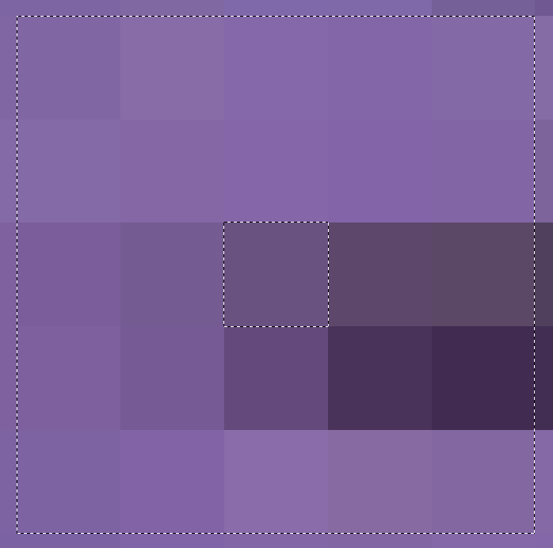

# Color schemer
In this project, I use MATLAB to analyse images by reading the RGB values of pixels, with the goal of creating a color pallette based on that image. During the proces, the source image is **resized** and **blurred**, the pixels are **seperated into color spaces** and **averaged**, and a set of curated colors are selected based on **spatial proximity** in a cartesian coordinate system.

Four different images are processed. All files and outputs are available in repo.

## Loading and resizing
The image is read with MATLABs `imread()` functions. A scaling factor is calculated to get the width of the picture to be close to 500 pixels. Array subscript indexing is used for the size reduction.
```matlab
function reduced_image = reduce_image_size(im)
    im_dims = size(im);
    sorted_sizes = sort(im_dims);

    %Calculate scaling factor to get image width close to 500 pixels
    factor = ceil(sorted_sizes(2) / 500);
    
    % MATLAB function 'image' expects a 3-page array of type uint8
    reduced_image = uint8(im(1:factor:end, 1:factor:end, :));
end

```

## Blurring
The pictures is blurred by taking all of the pixels in a radius around a pixel, and averaging their value. The averaged value becomes the new value for the corresponding pixel, stored in a different array of appropriate size.



```matlab
function blurred = blur(source, r)
    % blurs pictures with a provided radius 'r'
    % This function removes the r outermost pixels
    [height, width,~] = size(source);
    
    %3D array to store blurred image
    blurred = zeros(height, width, 3);
    
    for col = 1+r:width-r
        for row = 1+r:height-r 
            % Extract cluster. Cluster is the [col, row] indexed pixel and
            % the r pixels around it
            cluster = source(row-r:row+r,col-r:col+r,:);
            
            for i = 1:3
                % load averaged values into img
                blurred(row, col, i) = floor(mean(mean(cluster(:, :, i))));
            end
        end
    end
    % Return uint8 type array with r outermost pixels removed
    blurred = uint8(blurred(r+1:height-r-1, r+1:width-r-1,:));
end
```


