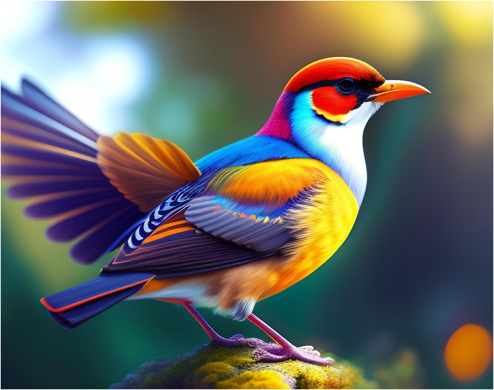
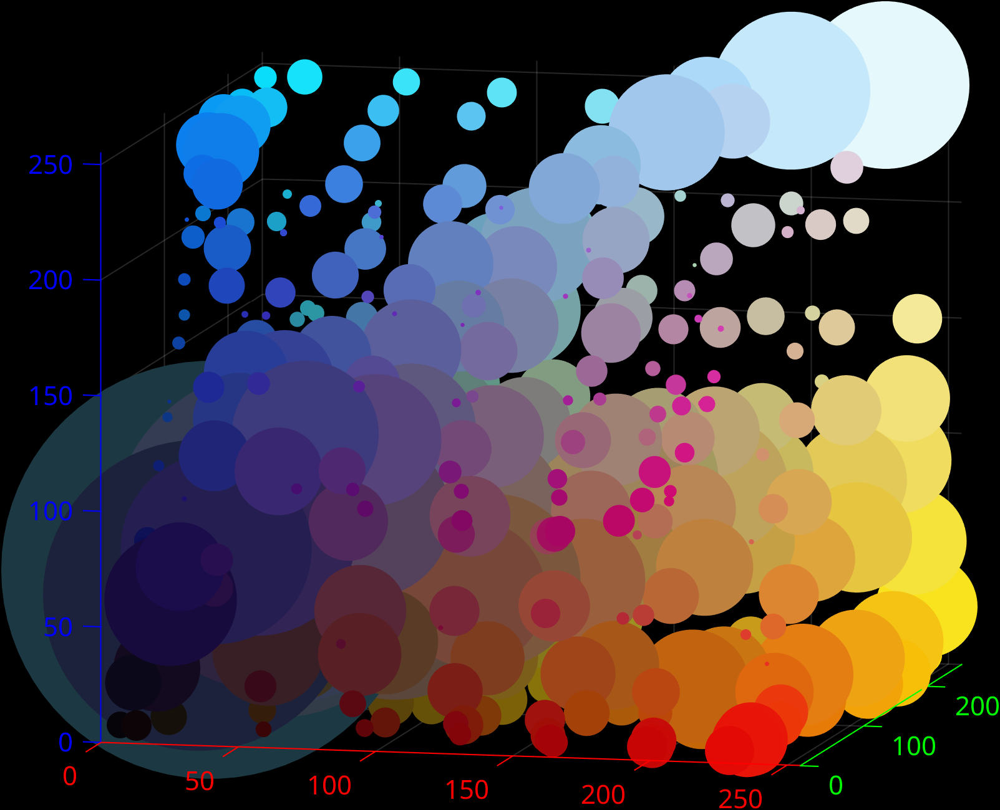
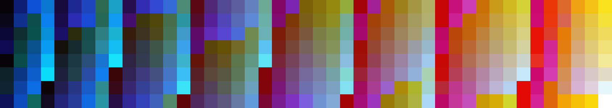
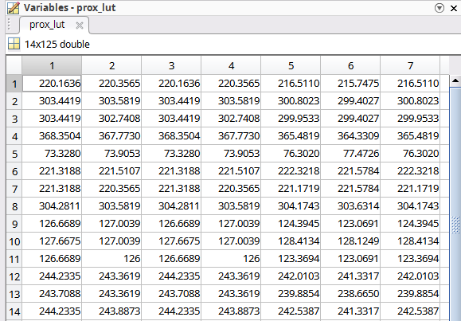
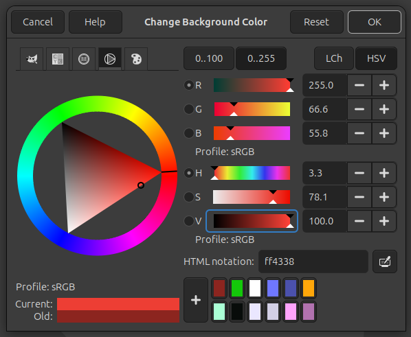
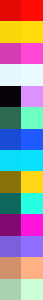

# Color schemer

In this project, I use MATLAB to analyse images by reading the RGB values of pixels, with the goal of creating a color pallette based on that image. During the proces, the source image is **resized** and **blurred**, the pixels are **seperated into color spaces** and **averaged**, and a set of curated colors are selected based on **spatial proximity** in a cartesian coordinate system.

One image is processed in the following, but four different images and their outputs can be found in the repo.

## Loading and resizing
The image is read with MATLABs `imread()` functions. A scaling factor is calculated to get the width of the picture to be close to 500 pixels. Array subscript indexing is used for the size reduction.
```matlab
function reduced_image = reduce_image_size(im)
    im_dims = size(im);
    sorted_sizes = sort(im_dims);

    %Calculate scaling factor to get image width close to 500 pixels
    factor = ceil(sorted_sizes(2) / 500);
    
    % MATLAB function 'image' expects a 3-page array of type uint8
    reduced_image = uint8(im(1:factor:end, 1:factor:end, :));
end

```

## Blurring
The pictures is blurred by taking all of the pixels in a radius around a pixel, and averaging their value. The averaged value becomes the new value for the corresponding pixel, stored in a different array of appropriate size.


```matlab
function blurred = blur(source, r)
    % blurs pictures with a provided radius 'r'
    % This function removes the r outermost pixels
    [height, width,~] = size(source);
    
    %3D array to store blurred image
    blurred = zeros(height, width, 3);
    
    for col = 1+r:width-r
        for row = 1+r:height-r 
            % Extract cluster. Cluster is the [col, row] indexed pixel and
            % the r pixels around it
            cluster = source(row-r:row+r,col-r:col+r,:);
            
            for i = 1:3
                % load averaged values into img
                blurred(row, col, i) = floor(mean(mean(cluster(:, :, i))));
            end
        end
    end
    % Return uint8 type array with r outermost pixels removed
    blurred = uint8(blurred(r+1:height-r-1, r+1:width-r-1,:));
end
```

Below is the resized version as well as the blurred version of the source image. 



## Splitting the color spectrum
The main idea here is to treat each pixel with corresponding RGB values as points in a 3-axis cartesian coordinate system, with axes R, G and B. The space is divided into subspaces based on intervals on the axes. This way, the first cluster of pixels treated are those for which R, G and B values are less than 17. If there are more than `trim = 5` pixels in this cluster, a mean RGB value is calculated and added to a dynamic array of mean RGB values.

```matlab
% Color spaces are confined within intervals on the RGB axes RGB <--> XYZ.
    for R_i = 17:34:255
        for G_i = 17:34:255
            for B_i = 17:34:255
                % Using logical operators to determine what pixels belong
                % to current color space
                logic_R = R_values >= R_i-51 & R_values < R_i;
                logic_G = G_values >= G_i-51 & G_values < G_i;
                logic_B = B_values >= B_i-51 & B_values < B_i;
                logic_RGB = logic_R & logic_G & logic_B;
                % Indexes of pixels in current color space
                pixels_i = find(logic_RGB);
                
                % Compute colorspace if number of elements > trim
                if numel(pixels_i) > trim
                    % Calculate mean values
                    R_mean_val = mean(R_values(pixels_i));
                    G_mean_val = mean(G_values(pixels_i));
                    B_mean_val = mean(B_values(pixels_i));

                    % Store in dynamic array
                    mean_R(end+1) = floor(R_mean_val);
                    mean_G(end+1) = floor(G_mean_val);
                    mean_B(end+1) = floor(B_mean_val);

                    % Scatter color and dot sizes for plotting
                    scatter_color = [R_mean_val, G_mean_val, B_mean_val] / 255;
                    dot_colors(end + 1, 1:3) = scatter_color;
                    dot_sizes(end+1) = length(pixels_i) / (trim/2);
                end
            end
        end
    end
```

The color space is visualized with a scatter plot. Each averaged RGB value is represented by a dot which takes the color of that averaged RGB value, and the size of the dot corresponds to how many pixels were in the cluster. This way, it is possible to get a sense of how much of the original picture had this color.



For the `colorful bird` image, there are a lot of different colors all over the RGB space, which is seen from the scatter plot.

### Large color pallette
With all of the averaged RGB values, it is possible to create a large color pallette with all the averaged colors. The averaged color array is stored in a way to allow it to be treated as a RGB image.



## Curated color pallette
A smaller curated color pallette is computed. The strategy is to have a set of *anchor points* in the RGB space, which are spaced out widey from each other. Each corner of the color space, for example RGB = [0, 0, 0] and [255, 255, 255], has an anchor point, and the center of each side has an anchor point. For each anchor point, we will find the average RGB color from the scatter plot which is closest in proximity to that anchor point. That color is added to the curated color pallette.

```matlab
% anchor colors, of which there are 14, corresponding to corners + sides of a box
    anchors = zeros(14, 1, 3);
    anchors([1, 2, 3, 4, 13], 1, 1) = 255;
    anchors([2, 4, 6, 8, 14], 1, 2) = 255;
    anchors([3, 4, 7, 8, 12], 1, 3) = 255;
    anchors([9, 11, 12, 14], 1, 1) = 127;
    anchors([9, 10, 12, 13], 1, 2) = 127;
    anchors([10, 11, 13, 14], 1, 3) = 127;
    
    % Get pallette colors spatial proximity to anchor colors
    prox_lut = zeros(14, n_pallette);
    for i = 1:14
        x(1:3) = anchors(i, 1, :);
        for j = 1:n_pallette
            y(1:3) = pallette(j, 1, :);
            prox_lut(i, j) = norm(double(x)-double(y));
        end
    end
```

The rows correspond to an anchor point, and the columns show the distance between the anchor point and the RGB colors in the averaged RGB space.



### Selecting the curated colors
```matlab
% The curated colors are the colors closest in proximity to each of the
% anchor colors, with colors interpreted as points in a 3D coordinate
% system

for i = 1:14
    new_i = find(prox_lut(i, :) == min(prox_lut(i, :)), 1);
    curated_i(i) = new_i;
    prox_lut(:, new_i) = x;
end
```


### Boosted colors
To make sure there are some bright colors in the pallette, I choose to compute a boosted color from a corresponding curated averaged color. A different method from using RGB is to use **HSV** (Hue, Saturation, Value). When moving the **V** slider, the RGB values will move an amount proportional to their initial size. For a red dominated color, where the R value is larger than the G and B values, the R value will increase more, proportional to the ratio between R, G and B. Maximizing the **V** value corresponds to maximiing the dominating RGB value, for example red. The result is a color where the ratio between R, G and B is kept, but the intensity and brightness of the color is increased.

The color wheel from **GIMP** is shown underneath. The old color is a dark red. Pushing the **V** slider to 100 boost the **R** slider to 255, while the **G** and **B** hasn't moved nearly as much, since the old color was dominated by red. The new color is a boosted version of the old.

 

```matlab
% Calculating the boosted colors
V_boost = zeros(length(pallette),1, 3);

for i = 1:length(V_boost)
	ref = max(pallette(i, :)); % get the highest R, G or B
	sf = 255 / double(ref); % calculate scaling factor to boost that to 255
	
	% Scale R, G and B with sf
	V_boost(i, 1, :) = uint8(double(pallette(i, 1, :)) * sf);
end

% Adding boosted colors to pallette
pallette(:, 2, :) = V_boost;
```


### Curated pallette
The left column are the curated colors. They have a nice spread across the color spectrum thanks to the strategy of wide spread anchor colors. The right column are the boosted colors. It can be seen how boosted colors are similar to their original counterpart, but brighter and more vivid. The black color went to a light purple, because the RGB ratio was a purple tint so dark that it seemed black.




