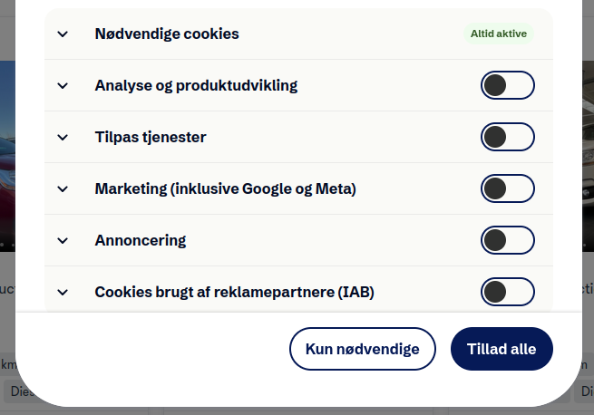
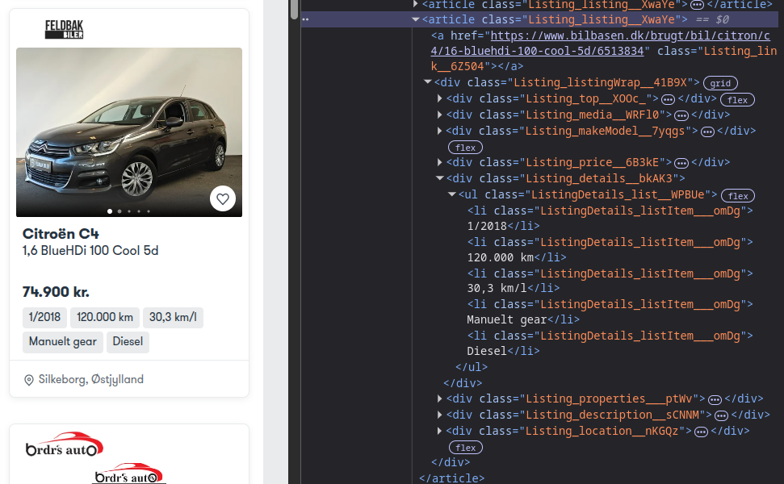
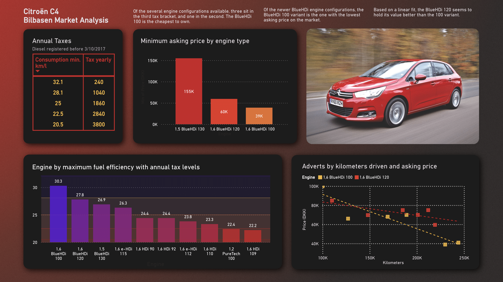

# Car data mini-project
I want to get some data on cars for sale, to see if I can make an informed decision on which car to buy. I have an idea that the Citroën C4 would be a good fit, as it is economical, reasonably priced, can be equipped with a tow hook and more. To get an idea of the market, I set out to scrape Bilbasen.dk, one of the major online used-car dealing sites, to see if I can learn something about the market.

I used Python for the data scraping. The script is available to look at in the file `C4scraping.py`, and the resulting dataset is available to look at in the CSV file `bilbasen_scrape.csv`.

## Starting a driver for scraping
I use the **[Selenium](https://www.selenium.dev)** package for scraping. I choose to use Brave Browser, which is a privacy oriented browser based on Chromium, which is supported by Selenium. I configure the selenium.options(), such that it has the location of Brave on my PC. I have made an initial query on the website with a few filters to get started, such that the URL I provide goes directly to the results of that query.  
## Handling pop-up message
As for any website nowadays, you have to accept some level of cookies. The driver needs to handle this as well. The pop-up message is a seperate iframe from the main site, so I switch into that frame, find the "Only Necessary" button by inspection of the HTML, and commands the driver to click the button. Finally, we switch back to the main sites iframe.

## Getting advert details
The website contains a number of cards, each card being an advert for a car on sale. The card has the data we are looking for for now. More information could be scraped by clicking and opening each advert, but for this project, I leave additional data out.

The scraper searches through the HTML, as can be seen by inspecting an element on the website. A card is found by looking for class name "Listing_listing_XwaYe", of which there are several, one for each card/advert. The data can be extracted as one string with `element.text`, and seperated by splitting where there is a `'\n'` character.

## Saving data in csv file
The scraping ends up with me having a list of dictionaries, each one having the data of an advert. Bilbasen returned 62 cars on my initial query, why I have a list of length 62. I use **Pandas** to export the list to a CSV file, which I will use for data analysis later on.

## Power BI
I'm still very early in my Power BI adventures, but I loaded the csv file into Power BI to do some transformations, visualizations and reporting, and this is what came out:

